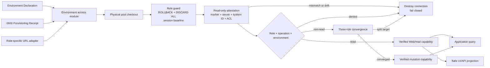

# ADR 0005：使用可证明的 Environment Contract 隔离运行环境

- 状态：Accepted
- 日期：2026-08-31
- 关联：[Medota2 Domain Context](../../CONTEXT.md)、[项目技术选型与数据处理架构](../architecture/technology-selection.md)、[ADR 0001：Hero Catalog 使用单一原子版本边界](0001-hero-catalog-version-boundary.md)、[ADR 0004：Hero 与 Ability 图标使用数据库资产数据集](0004-database-icon-asset-datasets.md)、[ADR 0006：使用 Run-scoped Harness 隔离自动验证](0006-run-scoped-verification.md)

本 ADR 定义环境身份信任根；测试运行与持久数据栈的后续物理隔离由 ADR 0006 扩展，不改变这里的 attestation 与 capability 决策。

## Context

本 ADR 作出决策时，Medota2 使用一个 PostgreSQL Compose service 和三个数据库名：`medota2`、`medota2_local`、`medota2_test`。Web、Worker 与 migration 虽然使用不同数据库 role，但三个 role 可连接同一组数据库。代码通过 `DATABASE_URL_*`、`*_LOCAL`、`*_TEST`、命令别名和数据库名后缀表达目标；裸 `pnpm dev`、多数数据命令和调度入口又默认使用没有后缀的 `main` target。

这些约定能在配置完全正确且任务串行时提供一定隔离，但不能证明当前连接属于预期环境：

- `NODE_ENV` 只描述 Next.js/Node.js 运行模式，不描述数据库；
- URL 变量名、pathname 中的 `_test`/`_local` 和端口都可能被误配；
- migration、Worker 和 Web URL 相互独立，可能分别指向不同数据库；
- PostgreSQL role 可以跨数据库连接时，误配不会自然得到 permission denied；
- Web 页面展示 source commit、ClientVersion 和 dataset gate，却没有可信的 Runtime Environment 或 Data Class；
- test seed 与 local reset 的数据库名检查发生在 migration 之后，不能满足“任何 DDL/DML 前验证”的安全边界。

Medota2 已经为 Hero Catalog、Asset Dataset 和 Source Snapshot 建立了严格版本身份，但这些身份描述数据，不描述运行环境。生产来源资产可以位于本机 Review 数据库；synthetic fixture 也可以保留真实来源布局和审计 commit。需要新增与数据版本正交的 Environment Contract。

## Decision

### 1. 采用正交的环境概念

采用 [CONTEXT.md](../../CONTEXT.md) 定义的四个概念：

- Runtime Environment：`development | test | local-review | production`；
- Data Class：`sandbox | synthetic-fixture | production-snapshot | live-production`；
- Database Identity：PostgreSQL 内声明的 instance/database/environment/data-class/role 身份；
- Run Identity：一次进程或自动化执行的身份。

进程必须显式声明一个 Runtime Environment 和 Data Class，并在初始化后保持不变。没有 `main` 默认值；`NODE_ENV`、数据库名、Git 分支和 source commit 都不能推导 Runtime Environment。

允许的典型组合为：

| Runtime Environment | Data Class            | 预期用途                                           |
| ------------------- | --------------------- | -------------------------------------------------- |
| `development`       | `sandbox`             | 可重建的内部迭代与数据构造。                       |
| `test`              | `synthetic-fixture`   | 自动化测试。                                       |
| `local-review`      | `production-snapshot` | 本机查看真实来源数据和正式资产，不等同于线上运行。 |
| `production`        | `live-production`     | 正式服务。                                         |

其他组合必须由集中 policy 明确允许，不能由 caller 自行放宽。特别地，`test + live-production` 禁止。

### 2. 使用 PostgreSQL marker 建立 Database Identity

每个数据库由 provisioning control plane 在 `medota2_control.environment_identity` 中登记唯一 marker。marker 至少包含：

```text
contract_version
instance_id
database_id
database_name
environment
data_class
state
reset_policy
migration_role
worker_role
web_role
created_at
```

同一 PostgreSQL instance 中的数据库共享 `instance_id`，每个数据库有独立 `database_id`。PostgreSQL 自身的 `system_identifier` 不复制进 marker，而是在 attestation 时从 server control data 读取并与外部 receipt 核对。同一逻辑数据库的 migration、Worker 和 Web 连接必须读取到完全相同的 marker，并分别以 marker 声明的 role 作为 `session_user`。

`medota2_control` 不属于普通产品 schema：Web/Worker 只获得读取 marker 所需的最小权限，普通应用 migration 不创建、更新或自动修复 marker。缺表、缺行、重复 marker 或字段不匹配全部 fail closed。

### 3. 进程只声明一次 Environment Contract

进程启动时从单一配置入口解析 Environment Declaration。declaration 包含预期 Runtime Environment、Data Class、instance/database UUID 和 Run Identity；database name 由受限 credential adapter 与外部 receipt 共同限定，role/operation 由每次 capability 请求声明。解析完成后冻结；修改 `process.env` 不会切换已初始化的进程或连接池。declaration 与实际数据库完成 attestation 后才成为 Verified Environment Contract。

instance/database UUID 来自操作者控制的显式配置或 provisioning receipt，不能由正常数据库入口从正在验证的数据库读取后再作为“预期值”回填。本地 provisioning/adoption 对每个 Git 忽略的 `0600` receipt 使用临时文件 + rename：runtime/control recovery receipt 在只读 preflight 与锁获取成功后、数据库 cutover 前写入，identity receipt 只在三库 × 三角色 active postflight 成功后签发。三份文件不是跨文件系统与 PostgreSQL 的单一原子事务；cluster lock、防失败 quarantine 和完整重跑共同处理该 seam。正常进程初始化时核对 receipt 和数据库 marker 后冻结 expected identity。当前本地 adapter 把三库 × 三角色 URL 放在同一份当前用户所有的文件中，再由 `MEDOTA2_PROCESS_ROLE` 限制正常 caller 选择；因此它是应用 admission boundary，不是同一 OS user 下的秘密隔离。真正的 process secret isolation 需要不同 OS/container identity 分别注入单一 credential。当前本地威胁模型信任 receipt 与进程配置；远程 production 的分发与密码学 trust root 不在本 ADR 中定义。

数据库 URL 是 credential/transport adapter 的输入，不是环境事实。非 production URL 只能来自上述私有 receipt；`.env` 中的非 production URL、bootstrap password 和 bootstrap URL 会被剔除。production 暂由显式 `DATABASE_URL_*_PRODUCTION` 提供并强制 `verify-full`。正常 application interface 不返回裸 URL，也不允许 caller 自己创建 `pg.Pool`。

### 4. `openVerifiedDatabase` 是唯一正常数据库入口

正常 Web、Worker、migration、seed、reset 和运维 caller 统一调用一个按 role/operation 判别的 interface：

```ts
openVerifiedDatabase(
  | { role: "web"; operation: "read" }
  | { role: "worker"; operation: "fixture" | "import" | "review" | "promote" | "rollback" }
  | { role: "migration"; operation: "migrate" | "seed" | "reset" },
): Promise<VerifiedDatabase<Operation>>
```

`VerifiedDatabase` 是 opaque、operation-branded verified capability；其构造器、raw URL、raw pool 和 `PoolClient` 不导出。Web/read facade 不导出 `connect()`，每条 caller 查询都包在已经锁定模式的显式只读事务中，并强制 unnamed extended query protocol，避免多语句逃逸。mutation capability 的 `connect()` 只返回带 `query/release` 的 `VerifiedSession`。TypeScript interface 使不合法的 role/operation 组合在正常 caller 中不可表达，运行时 policy 再做第二次拒绝。尤其：

这个 environment access module 保持窄小的 public interface，把配置解析、credential 选择、pool lifecycle、marker 查询、policy 判定和错误归类留在 implementation 内部，形成一个 high-depth 的 deep module。它用集中 seam 提高 leverage 和 locality，避免每个 caller 再拼装 shallow 校验。

- migration runner 不再接受 `databaseUrl: string`；
- Worker helper 不再默认 `main` target；
- Web pool 不允许在进程内通过修改环境变量切库；
- seed/reset 不再以 `_test` 或 `_local` 字符串作为授权依据；
- 计划任务必须走显式环境合同；无法消费 verified capability 的第三方连接器不构成受支持的 adapter。

每个 PostgreSQL pool checkout 都先完成 attestation，不能只验证 pool 的第一条连接。contract v1 不跨 checkout 缓存“该连接已经安全”的结论，因此上一次借用遗留的 transaction、temporary object、`SET ROLE`、GUC、marker 变化或 ACL drift 会在复用前被清除、拒绝或销毁连接。已经签发且尚未 release 的 mutation session 不会在每条 SQL 前重新读取 marker；本地 cutover 通过关闭数据库入口、终止全部旧 session 和撤销 login 来收敛该窗口。通用 revocation epoch/lease 留待后续设计。

### 5. 任何 DDL/DML 前执行只读 attestation

本文的“任何 DDL/DML 前”指：除严格 allowlist 的 control-plane attestation SQL 与安全 session setup 外，任何应用查询、DDL、DCL 或 DML 都必须在验证成功后执行。attestation 只能读取身份和只读状态，不能访问产品数据、创建 schema、写 ledger 或自动修复 marker。

物理连接建立后，先执行 role guard；随后 `ROLLBACK` 遗留事务、`DISCARD ALL` 清除 temporary object/prepared statement/GUC，再恢复 `application_name`、固定 `search_path`、`row_security=on` 与 role-specific `default_transaction_read_only`。这些是安全 session setup，不是应用查询。之后在显式 read-only transaction 内至少验证：

```text
current_database()
session_user / current_user
inet_server_addr() / inet_server_port()
pg_is_in_recovery()
transaction_read_only
default_transaction_read_only
PostgreSQL system_identifier
medota2_control.environment_identity
role attributes / membership / table + column ACL / object ownership
```

验证顺序固定为：

```text
process declaration
      │
      ▼
connect physical PostgreSQL session
      │
      ▼
allowlisted read-only identity + marker attestation
      │
      ├── missing/mismatch/role drift/policy denied ──> close + fail
      │
      ▼
create opaque verified capability
      │
      ▼
application query / schema check / DDL / DCL / DML
```

attestation 必须核对 Environment Declaration、初始化时冻结的外部 receipt 身份、marker、configured endpoint、observed server、PostgreSQL system identifier、数据库名、三个 role 声明、session baseline、ACL 和 operation policy。`session_user` 必须等于当前 capability 的预期 role，`current_user` 必须与其一致。Web 必须同时满足默认事务只读、无业务表/列/序列写权限、无持久 DDL/ownership、无 control marker 写权限或可执行的可写 security-definer 函数；Worker 可以持有业务 DML 与直接 allowlist 函数权限，但不能持有持久 DDL/ownership、control 写入、role membership 或高权限属性。所有应用 SECURITY DEFINER routine（包括 Worker 不可直接 EXECUTE、但被受信任函数调用的 helper）必须是受审签名/owner/kind/`search_path`/规范化定义 SHA-256 清单的子集；应用 user trigger/rule 默认为零，避免间接 definer 执行。写操作还必须拒绝 recovery target。只有全部通过后，caller 才能运行 `schema_migrations` ledger、产品 migration、TRUNCATE、import、promotion 或 rollback。

失败模式必须稳定且 fail closed：declaration 无效、连接失败、marker 缺失/重复/版本不支持、identity 不匹配、role drift、policy denied、recovery/read-only target 都关闭连接且不回退到其他环境。对外错误只包含安全的分类与 fingerprint，不回显 URL、用户名或密码。

普通 session baseline 固定为 `pg_catalog, public, pg_temp`，减少 search-path hijack。已审阅 migration 仍包含历史上未限定 schema 的 DDL，因此 migration runner 只有在 capability 验证成功后，才在该 migration session 内切换为 `public, pg_catalog`；Web/Worker baseline 不随之放宽。这是 legacy migration adapter，不是全局 search-path fallback。

### 6. 三角色 convergence 与最小凭据并存

日常 Web interface 只请求 Web credential，并验证自己的连接与 marker；它不为了读取而打开 Worker 或 migration connection。当前单用户本地 receipt 仍包含全部本地 URL，故这里的“最小凭据”是 adapter/API 选择范围，不是 OS 文件可见性声明；不同安全主体的部署必须拆分 secret injection。

三角色 convergence 在 database provisioning、显式 local-stack cutover 和 environment doctor 中验证。除此之外，每次签发非 `read` capability 时，access module 会打开另外两个 role 的 attestation-only peer connection；三个连接必须匹配同一个 expected-identity block、configured/observed endpoint、PostgreSQL system identifier、`instance_id`、`database_id`、database name、Runtime Environment 和 Data Class，并分别匹配预期 role。任一 role credential/URL、server 或 marker 分叉都不能获得写 capability。Web/read 日常路径只选择和打开 Web connection，不为了读取而连接其他角色。



### 7. 破坏性操作由 operation policy 授权

Environment Contract 同时验证“连到哪里”和“准备做什么”。contract v1 的正常 capability operation 封闭枚举为 `read`、`fixture`、`migrate`、`import`、`review`、`promote`、`rollback`、`seed` 与 `reset`；adoption 位于独立 control-plane interface。role × Runtime Environment × Data Class × operation 矩阵默认 deny。`fixture`、`seed`、`reset` 等数据构造或破坏性 operation 必须满足 policy 的 Run Identity 或精确确认要求，并仅允许在 policy 明确授权的环境运行。

- `test + synthetic-fixture` 的 Worker 只开放 `fixture`；测试数据库 migration 可在测试合同内 seed/reset，但不能把真实数据 `import` adapter 当成 fixture seam；
- `development + sandbox` 可由独立开发策略允许重建；
- `local-review + production-snapshot` 的普通启动禁止 reset；只有独立 preview rebuild 命令同时声明 `reset`、marker 为 `explicit-rebuild` 且精确确认 database name 时才允许；
- `production + live-production` 在本 policy 版本中只开放 `Web/read`，所有 Worker 与 migration capability 均拒绝；未来若需开放，必须另立 ADR。

operation brand 负责把 caller 路由到正确 adapter 并执行 admission policy，不是 SQL parser 或 statement-level sandbox；数据库最终权限由 PostgreSQL role grants 强制。本 ADR 只定义 Run Identity 和授权边界；ADR 0006 已进一步实现每个测试 run 的 database/lease、动态端口、Next dist 和报告目录隔离。

### 8. 预置 marker 的本地栈通过显式 cutover 接入

正常 `openVerifiedDatabase` 遇到缺失 marker 必须失败，不能让 migration 顺手创建 marker。Fresh Docker/IaC provisioning 先创建三条 `quarantined` marker、环境专属 NOLOGIN roles 和最小 database ACL；随后 CLI-only cutover seam 才能激活运行入口。旧 role/ACL 布局也只有在三库已经存在结构正确、身份一致的 contract-v1 marker 时才可接入。未知、无 marker 的 legacy 库明确不在本命令的授权边界内，必须另立 ADR 设计 provisioning/restore seam。

cutover 顺序为：

1. 要求三库精确确认；已有 control receipt 是正常 trust input，首次运行才允许 shell/keychain 中的 bootstrap password/URL，`.env` 中的 bootstrap secret 会被拒绝；control session 在读取/写入 recovery receipt 或轮换任何密码前取得唯一 cluster cutover lock，并发命令立即拒绝；
2. 锁内 control preflight 证明 `current_user = session_user`、唯一 cluster superuser、无 membership、三库同一 system identifier；拒绝 prepared transaction、event trigger、FDW/server/user mapping/foreign table、publication/subscription/slot/origin、未知 ACL principal、非空且非规范的 default ACL、marker/control shape 漂移、未审 SECURITY DEFINER 定义及应用 trigger/rule；
3. 所有只读预检通过后，先取得三库 advisory lock，再分别原子写入 `0600` runtime/control recovery receipts；随后关闭三库新连接、把全部 marker 置为 `quarantined`、终止旧 session、保持 runtime `NOLOGIN`，最后才轮换 control password；
4. 创建/收敛环境专属 migration/Worker/Web 和 NOLOGIN control-owner roles；更改 database/schema/application-object ownership，撤销定义范围内的 PUBLIC/legacy/cross-environment 授权并重建规范 baseline；未知主体在 preflight 拒绝，已知但多余的残留授权在 postflight 拒绝并保持 quarantine，而不冒险泛化自动修复。隔离后严格核对并转移 `pgcrypto 1.4` 的精确成员清单；唯一允许临时 drop/recreate 的应用依赖是已精确匹配的 asset checksum constraint；
5. 先在 `quarantined` 状态完成三角色完整 Environment Contract postflight，再一次性激活三个 marker、开放 runtime login，并重复 active-state postflight；最后才签发 identity receipt。

该命令不运行产品 migration，不执行业务表 INSERT/UPDATE/DELETE/TRUNCATE，不移动 Catalog/Asset head，也不重建资产；但它会轮换 credential、改变 owner/ACL、终止 session，并可能在精确形状验证后重建上述 constraint，所以不是“纯只读 adoption”。cutover 前失败不改数据库状态；cutover 后失败会尝试把三库保持 `quarantined`、runtime `NOLOGIN`。若恢复本身无法被证明，数据库状态必须视为未知，操作者应保持应用停止并人工核对，不能把错误消息当作“连接一定关闭”的证明。幂等重跑仍从完整 preflight 开始，不跳过检查。

现有 `medota2_local` 应声明为 `local-review + production-snapshot`，该分类不把它提升为 `live-production`。高价值 rollout 前后应另存逻辑备份、schema/migration ledger、Catalog/Asset head、关键计数和公共 schema fingerprint；receipt 不是数据备份。

### 9. Public projection

Verified Environment Contract 提供不含 URL、用户名、密码、完整 identity UUID、PostgreSQL system identifier 和本机路径的 public projection，供全局 UI、Catalog API response header、日志和测试断言使用。它包含 Runtime Environment、Data Class、database name、安全截断 fingerprint 和 Run Identity。若 attestation 失败，页面/API 只允许投影 declaration 中的环境/Data Class，并必须同时标记 `unverified` 与 `DATA ACCESS BLOCKED`；不能展示或猜测 database identity。

页面上的 environment 表示必须来自当前 render 的 fresh attestation，不能由 `NODE_ENV`、端口或 fixture 内容生成。`local-review` 的 UI 文案只能说明 `production-snapshot` classification 与“不是 live-production classification”，不能仅凭分类声称物理隔离已经被证明。Hero Catalog/Asset Dataset provenance 继续独立展示。

本地 development 固定使用 `127.0.0.1:3000`，local-review 固定使用 `127.0.0.1:3001`；test/E2E 由 Harness 每 run 分配唯一 loopback origin。该 browser-state adapter 把 Local Storage、IndexedDB、Cache Storage 与按完整 URL 寻址的 HTTP cache 分开，降低浏览器沿用另一个环境结果的风险；端口仍不是可信环境身份。Cookie 的作用域不包含端口，未来若引入环境敏感 Cookie，必须按 Runtime Environment 命名或改用不同 host。

### 10. 不接纳无法消费 verified capability 的第三方连接器

Drizzle Studio 自己建立并管理 raw connection，无法消费 Medota2 的 `VerifiedSession`，所以无法满足 per-checkout attestation、环境 public projection 或最小 secret 注入。contract v1 不提供 `db:studio`；`drizzle.config.ts` 只保留离线 schema generation 配置且不包含 `dbCredentials`。未来若要恢复 Studio，必须先设计能强制 development、单一 Web credential、fresh attestation 和可见环境标识的 bounded adapter，不能把启动前提示等同于持续合同。

## 安全边界

本决策主要防御：

- 本地开发、自动化测试和运维命令误连其他数据库；
- migration/Worker/Web 三条 URL 分叉；
- 用 `_test`、`_local`、`NODE_ENV` 或默认 `main` 误判环境；
- marker 缺失时自动 bootstrap 并信任未知数据库；
- pool 后续物理连接绕过首次验证；
- 测试 fixture 与 production-snapshot 在 UI/API 中不可区分。

本决策不声称防御已经控制本机进程、操作系统、PostgreSQL superuser 或 provisioning control plane 的攻击者。marker 是强制的数据库身份与防误操作边界，不是对恶意 superuser 的密码学证明。

部分敏感系统 catalog（尤其 `pg_subscription`、`pg_user_mapping`）不允许普通 runtime role 完整读取，因此 runtime attestation 只使用公开可读的外链/复制 catalog；subscription 与 user mapping 由 superuser control preflight 检查，foreign server 仍会在 runtime probe 中暴露 user mapping 所依赖的基础对象。由普通 runtime doctor 单独运行不能替代 adoption 的 control-plane 全量检查。

当前本地信任锚是由操作者控制、独立于目标数据库的 expected-identity 配置。PostgreSQL system identifier 能识别把逻辑备份恢复到另一 cluster 的情况，但完整物理 cluster clone 会复制 system identifier；若操作者又刻意复用旧 receipt、declaration、endpoint 与凭据，合同不能密码学区分两个 clone。该情形属于 control-plane/主机配置被错误控制，超出本 ADR 的防护声明。

Medota2 的 production 部署形态尚未定义，因此本 ADR 不引入签名 target manifest、远端 TLS certificate/SPKI pinning 或生产密钥基础设施。未来决定远程 production topology 时，必须用新的 ADR 评估传输认证、secret distribution、marker 防篡改与部署 trust root，不能把本地 marker 设计静默扩展成完整远程安全声明。

### 红蓝对抗结论

| 红队路径                                                                | 蓝队控制                                                                                                   | v1 结论                                         |
| ----------------------------------------------------------------------- | ---------------------------------------------------------------------------------------------------------- | ----------------------------------------------- |
| 把 test/local URL 指向远端或另一库                                      | 非 production 仅 loopback；receipt + marker + configured/observed endpoint + system/database identity 一致 | fail closed                                     |
| 利用重复 `sslmode`、fragment 或未知 query option 降级 production TLS    | URL parser 拒绝重复/未知/歧义参数；production 强制唯一 `sslmode=verify-full`                               | fail closed                                     |
| migration/Worker/Web 三条 URL 指向不同目标                              | non-read capability 签发前做三角色 convergence；doctor 可独立诊断                                          | 写 capability 拒绝                              |
| pool 复用遗留事务、temp table、`SET ROLE` 或危险 GUC                    | role guard、`ROLLBACK`、`DISCARD ALL`、固定 baseline、每 checkout 重新 attestation                         | 清除或销毁连接                                  |
| 给 Web 偷授整表或单列 DML、sequence、control marker 权限                | table + `has_any_column_privilege` + sequence + control ACL probe；Web 默认事务只读                        | capability 拒绝                                 |
| 给 Worker/Web 偷授 schema/database CREATE 或对象 ownership              | 持久 DDL/ownership probe；Worker/Web 高权限属性和 membership 必须为零                                      | capability 拒绝                                 |
| 篡改 allowlist 函数体、间接 helper，或用 trigger/rule 绕过直接 grant    | 全应用 SECURITY DEFINER 定义 SHA manifest + direct EXECUTE 子集；应用 trigger/rule 默认为零                | adoption/runtime capability 均拒绝              |
| 向 `pgcrypto` 偷加 extension member 或利用依赖转移 owner                | 锁定 PostgreSQL 18 / pgcrypto 1.4 精确成员 manifest，并只允许一个精确 asset constraint 依赖                | cutover 在隔离态拒绝；runtime doctor 拒绝       |
| 给未知 role 偷授 database/schema/object ACL                             | control preflight 枚举 database/schema/relation/column/routine/type/LO/default/FDW/server/parameter ACL    | cutover 前拒绝，不自动撤销未知主体              |
| cutover 前仍有长连接或准备好的事务                                      | prepared transaction 必须为零；关闭三库连接、终止旧 session、先 quarantine 再更改 ACL                      | 旧 session 被强制终止                           |
| Web read 通过多语句或事务模式切换逃逸                                   | 不公开 `connect`；显式 READ ONLY 后先执行查询锁定模式；unnamed extended protocol                           | DML/DDL 与多语句拒绝                            |
| development 与 local-review 复用浏览器 origin，沿用缓存或 Local Storage | 固定拆分为 `3000` 与 `3001`；test/E2E 使用 per-run loopback origin；页面仍展示 fresh attestation 结果      | origin-scoped state 分离；Cookie 仍不按端口隔离 |
| UI 沿用进程启动时旧结论                                                 | 每次 server render 和 Catalog API response fresh verify；失败只投影 declaration/unverified                 | 不展示伪 verified                               |
| marker 在一个已签发 mutation session 中途被 quarantine                  | 本地 cutover 关闭入口并终止 session；普通 checkout 下次必重新验证                                          | 本地 cutover 收敛；通用 lease/epoch **未实现**  |
| 两个 integration/E2E run 共享库和报告目录                               | ADR 0006 的 Harness 为每 run 签发独立 lease/database/port/artifact namespace                               | 已由独立 module 解决                            |
| 恶意主机管理员、PostgreSQL superuser 或完整物理 cluster clone           | 不在本地防误操作合同的信任边界内                                                                           | **非防护声明**                                  |

## Consequences

### 正向结果

- 环境从命名约定升级为数据库和进程共同证明的合同。
- 所有高风险路径在 DDL/DML 前经过同一验证 seam。
- Web、Worker 和 migration 的正常 interface 只选择本角色 credential；部署到不同安全主体后可进一步实现物理 secret 最小化。
- Runtime Environment、Data Class、Run Identity、Hero Catalog version 与 Asset Dataset version 分别建模，页面可以准确表达“在哪里”和“看什么数据”。
- local-stack cutover 不修改业务行或 head，但会显式收敛 credential、owner、ACL、session 和受审 extension dependency。
- opaque capability 使“migration-before-check”在正常 interface 中不可表达，并为 architecture lint/test 提供清晰边界。

### 成本与限制

- provisioning 必须先于应用 migration 管理 marker，增加一次明确的 control-plane 步骤。
- 每次 pool checkout 都增加 session reset 与小型只读 attestation；这是有意用少量延迟换取环境与 ACL 漂移检测，不以“首条连接已验证”为由跳过。
- 同一用户的本地 credential receipt 是开发便利与进程级秘密隔离之间的折衷；当前不能抵御同 UID 恶意进程读取其他角色密码。
- 数据库 clone 会复制原 marker；在使用不同 expected-identity declaration 或 PostgreSQL system identifier 的目标环境中会被拒绝。未来 restore/reclassify 流程需要专门 control-plane 设计；contract v1 没有实现可直接调用的 reclassify 命令，不能把文档描述当成现有能力。
- marker 不能替代独立网络、credential、备份和生产访问控制。
- operation brand 是 interface/policy seam，不是 SQL statement sandbox；角色 grants 仍是数据库权限的最终 enforcement。
- contract v1 不提供 Drizzle Studio；这牺牲了一项便利工具，避免 raw third-party connection 成为绕过 seam。
- per-run 测试数据库与产物隔离由 ADR 0006 的 Test Run Harness 承担，Environment Contract 本身不重复实现资源生命周期。
- 已签发 mutation session 没有通用 revocation epoch；非 cutover 场景的 marker/ACL 紧急撤销要依赖终止 session，未来应增加 lease/epoch。

## 未选择的方案

- **继续使用 URL 后缀检查**：实现简单，但不能验证实际数据库、role 或三条 URL convergence。
- **只使用 `NODE_ENV`**：它描述框架模式，不能证明数据库身份或 Data Class。
- **让 migration 自动创建缺失 marker**：会把未知目标自动变成可信目标，违反 fail-closed 和 pre-DDL attestation。
- **每个 caller 自行验证**：形成多个 shallow helper 和不一致顺序，缺少集中 leverage 与 locality。
- **现在引入签名 manifest/TLS pinning**：远程 production topology、trust root 和 secret distribution 尚未决定，当前引入会提前固化未经审阅的部署架构。
