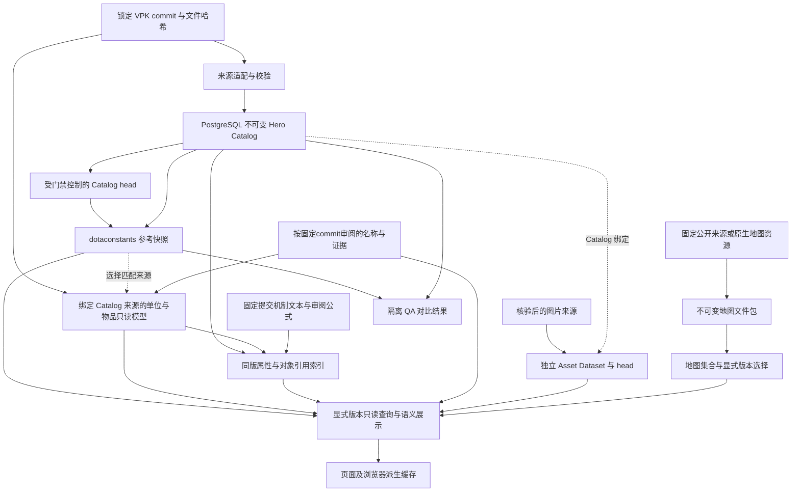

# 数据流与权威存储

状态：现行架构，按2026-10-07代码核对。术语由 [CONTEXT](../../CONTEXT.md) 定义；本文维护跨模块的数据流、写入者和版本关系，字段细节由各专项 Spec 维护。

## 从来源到页面

| 数据                       | 权威内容／选择                                                           | 写入者与消费者                                        | 版本及验证                                                        |
| -------------------------- | ------------------------------------------------------------------------ | ----------------------------------------------------- | ----------------------------------------------------------------- |
| 原始定义与本地化           | 锁定 Git 对象及 source manifest                                          | 来源适配器读取；来源仓库不由产品写回                  | 完整 commit、文件SHA、客户端／导入器／schema版本；不用工作树mtime |
| Hero Catalog               | PostgreSQL不可变记录；`dataset_heads('hero_catalog')`选择当前版本        | 导入Worker生成候选，受门禁函数提升／回滚，Web只读查询 | Hero／Ability／Facet／关系／本地化使用同一Catalog版本             |
| 英雄／技能、单位与物品图片 | PostgreSQL资产对象、LoD、绑定；各自head                                  | 资产导入器写入，图片路由读数据库                      | 独立资产版本绑定Catalog；来源、图片构建号、转换器分别记录         |
| 单位定义                   | 所选Catalog固定commit的Git文件                                           | `readPinnedUnitSnapshot`构建进程内只读模型            | 核对steam.inf与文件checksum；未形成独立数据库Unit Dataset         |
| 属性与机制证据             | 同Catalog英雄／技能及固定来源单位／物品；代码中审阅过的证据摘录          | attributes仓库构建最多两版内存索引，分页API及详情读取 | 无独立Dataset／head；文件hash与提交绑定，未知公式待同版引擎验证   |
| 物品定义                   | 所选Catalog固定commit的items.txt与双语文本                               | `readPinnedItemSnapshot`构建只读模型                  | 校验steam.inf，保留文件hash与原文；未持久化独立Dataset            |
| 补充语义文本               | 与Catalog来源匹配且通过checksum核对的本地化文件                          | 展示服务只读补充                                      | 不匹配时只显示可确认内容；完整持久化仍待实施                      |
| 名称研究补充               | 代码内审阅资源：实体身份、双语名称、证据URL／commit／文件SHA、用途名标记 | 文本服务与单位／物品只读模型填补缺名，不写业务表      | 只适用声明的source commit；同版文本优先，历史来源不能提供当前玩法 |
| 地图                       | 所选Dataset文件及provenance；Collection声明版本与默认项                  | 提取／导入Worker生成新目录，地图服务只读              | 每份底图、实体、地形和来源哈希核对；与Catalog版本独立             |
| 内存／IndexedDB            | 已验证业务版本的派生副本                                                 | 服务端投影、浏览器同步与筛选                          | head／内容块hash变化时更新；损坏丢弃或修复，不能回写规范值        |

Hero／Ability玩法以VPK为规范来源；dotaconstants只作QA/reference及有记录的图片路径映射。地图、图片和游戏定义可能具有不同版本证据，未确认的客户端版本保留为空。比如图鉴6918不能为地图6944或CDN图片提供隐含版本认证。

地图Collection优先于单包配置；显式未知版本拒绝，不能回退另一地图。没有文件包时的有限来源读取兼容路径见[地图 Spec](../specs/map-explorer.md)。浏览器持久化当前覆盖英雄／技能目录；页面壳和未获取详情不因此完全离线。

## 跨工作区同步

| 层           | 权威与责任                                                                                                     |
| ------------ | -------------------------------------------------------------------------------------------------------------- |
| 目标版本     | [dev-data.lock.json](../../dev-data.lock.json)在选定代码提交中固定数据commit、快照、manifest及schema／迁移摘要 |
| 交接内容     | 私有仓库中的不可变manifest及内容寻址对象；业务表、图片、来源和全部地图版本共同核验                             |
| 本机活动选择 | 受管active清单与applied manifest选择数据库lease和依赖；保留旧候选和切换恢复记录                                |
| 运行身份     | 本机receipt与数据库身份／权限合同联合验证；不从其他机器复制身份或凭据                                          |
| 一致性观察   | `pnpm data:status`在核验时间报告代码改动、目标／实际摘要和问题；报告不是其他机器的实时状态                     |

导出使用一致性只读事务；数据库有变化时在独立受管候选恢复，未变化时允许复用已验证数据库。地图或来源变化仍需验证和切换，不能被相同数据库摘要掩盖。切换受锁与写入保护约束，旧库和失败候选保留，内容不一致不能宣称同步完成。

发布、获取、恢复的命令副作用和失败处理见[运行手册](../development-data-sync-runbook.md)，协议由[同步 Spec](../specs/development-data-sync.md)维护。相同业务快照可以有不同workspace和数据库身份；完整原始客户端不必安装在消费机器。

## 代码入口与变更范围

| 任务              | 入口                                                                                                                        | 必须同时核对                                                                |
| ----------------- | --------------------------------------------------------------------------------------------------------------------------- | --------------------------------------------------------------------------- |
| Catalog来源与入库 | `src/importers/dota-vpk/`、`src/workers/import-catalog.ts`、`src/server/repositories/`                                      | [Catalog合同](../specs/hero-catalog-v2.md)、来源版本、数据库门禁            |
| 单位及补充文本    | `src/server/repositories/units.ts`、`src/server/services/game-localization.ts`                                              | 同Catalog来源、来源缺失行为、[单位合同](../specs/unit-catalog.md)           |
| 属性实体          | `src/server/repositories/attributes.ts`、`src/server/services/attribute-catalog.ts`、`src/data/attributes/evidence.v1.json` | [属性合同](../specs/attribute-catalog.md)、字段别名、证据提交、分页版本绑定 |
| 地图包与寻路      | `src/importers/dota-map/`、`src/server/map/`、`src/domain/map/`                                                             | [地图合同](../specs/map-explorer.md)、Dataset版本、导航及碰撞估算边界       |
| 浏览器目录        | `src/server/services/catalog-replica.ts`、`src/domain/catalog-replica.ts`                                                   | [缓存协议](../specs/browser-catalog-cache.md)、版本原子性和回退             |
| 业务快照交接      | `src/development/data-sync/`、`src/config/data-sync-state.ts`                                                               | manifest／schema、依赖完整性、活动身份和恢复门禁                            |

数据流变动更新本文的相应节点及专项合同；具体快照数字留在lock、manifest或带时间的审计记录，不在总览多处手写。

## 统一版本与变化

[Release](../specs/entity-versions.md)索引组合已发布完整Catalog与有依据的地图入口；新版本先通过全实体核验，旧仅地图入口规范化为完整版本别名，URL release和顶栏为消费者选择完整状态。Catalog head仅选择默认，历史资料、资产和单位来源各自固定；图鉴和地图构建号保持独立。版本间Diff由两个完整端点投影派生，保留来源、实现升级、未知结构和覆盖缺项；当前地图区域身份与完整机制尚未覆盖。索引／比较入口为 `src/server/services/releases.ts` 与 `src/server/services/entity-version-diff.ts`，存储与同步格式复用既有快照。
