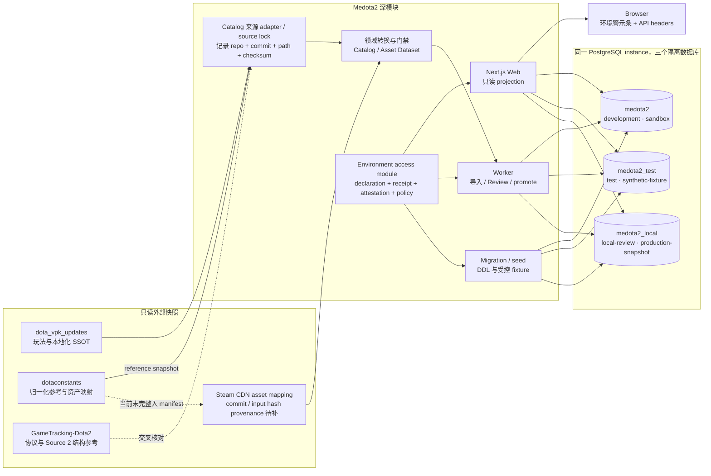
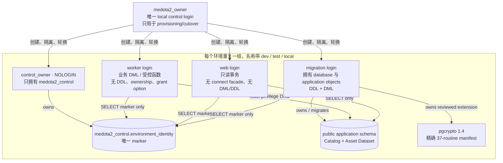
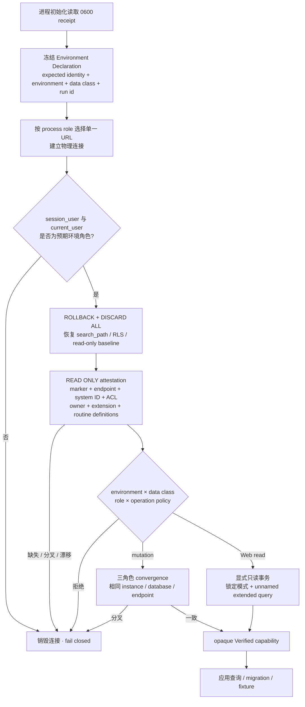
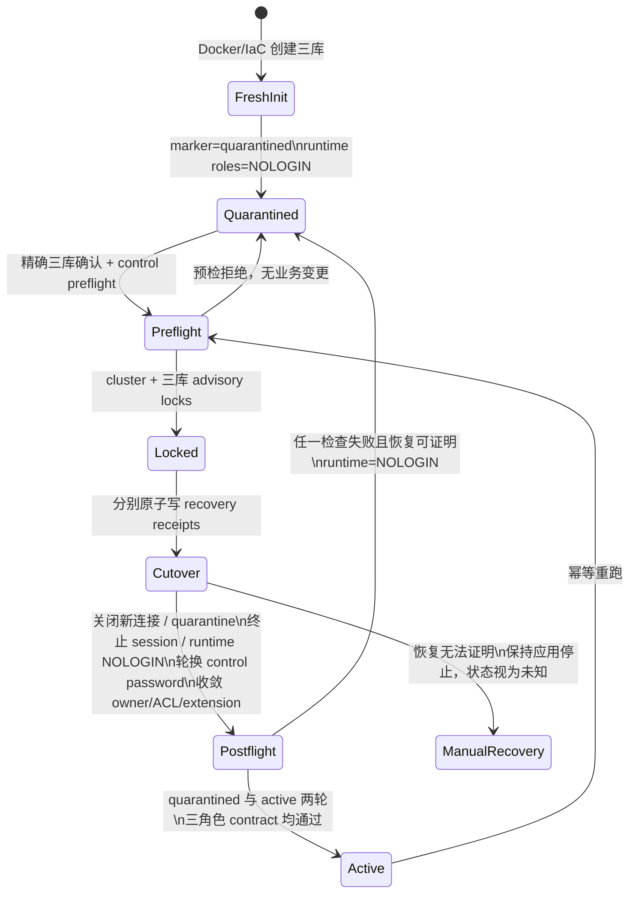

# Medota2 测试、环境与依赖架构 Review

> Review 基线：2026-08-31 · 方案 A（Environment Contract）

> 状态：历史审查快照。本文中的“当前”“待补”和方案 B 未完成结论只描述方案 A 完成时的基线，不再代表仓库目标态；后续实现与验收以 [Environment Isolation、Test Run Harness 与 Verification Evidence Spec](../specs/environment-isolation-and-verification.md) 和 [ADR 0006](../adr/0006-run-scoped-verification.md) 为准。现有 legacy `127.0.0.1:54321` 栈仍未获得或执行破坏性 cutover 授权。

## 一页结论

方案 A 已在代码中落地，并在一次性 PostgreSQL 18.2 栈完成蓝队验证与红队攻击验证。它把“我以为连的是测试库”升级为“进程声明、私有 receipt、PostgreSQL system/database identity、marker、role、ACL、endpoint 和 operation 全部一致后才允许访问”。

当前工作树已经具备这套能力，但 `127.0.0.1:54321` 上原有的三库尚未执行 owner / ACL / credential / session cutover：这一步会影响正在使用的本地连接，必须由操作者单独明确授权。验证使用的一次性容器不挂持久卷，不接触原有三库业务数据。

方案 A 解决的是**跨环境误连与环境不可见**。它还没有解决两个同时运行的测试 run 互相覆盖 fixture、端口、Next dist 或报告的问题；那是方案 B（Test Run Harness），不能在本 Review 中伪装为已完成。

## 现状的本质模型



关键边界：三个上游仓库不是 monorepo 子包，不随 Medota2 构建，也不提供比赛历史；它们只通过可配置、只读 adapter 输入。业务逻辑不能到处直接读取 VDF/KV3/上游 JSON，运行时页面只依赖 PostgreSQL 中已标准化的 Catalog 与 Asset Dataset。Catalog/source-lock 与 reference snapshot 已记录 provenance；Steam CDN 路径使用的 `dotaconstants/build/heroes.json`、`abilities.json` 尚未把 checkout commit、dirty/input-match、相对路径与输入 checksum 完整写进 Asset Dataset manifest，这是现状中的显式缺口。

## 环境与数据分类

| Runtime Environment | Data Class            | 数据库          | 浏览器 origin    | 常驻可见标识                                               | 写入边界                                                                  |
| ------------------- | --------------------- | --------------- | ---------------- | ---------------------------------------------------------- | ------------------------------------------------------------------------- |
| `development`       | `sandbox`             | `medota2`       | `127.0.0.1:3000` | `DEVELOPMENT / SANDBOX`                                    | 开发导入、Review、promotion、migration；reset 需精确库名                  |
| `test`              | `synthetic-fixture`   | `medota2_test`  | `127.0.0.1:3100` | `TEST / SYNTHETIC-FIXTURE / NOT LIVE-PRODUCTION`           | Worker 只开放 fixture；migration 可 migrate/seed/reset，必须有 Run ID     |
| `local-review`      | `production-snapshot` | `medota2_local` | `127.0.0.1:3001` | `LOCAL REVIEW / PRODUCTION-SNAPSHOT / NOT LIVE-PRODUCTION` | Web 只读；导入/提升/回滚需精确确认，reset 仅 explicit rebuild             |
| `production`        | `live-production`     | 无本地默认      | 部署显式提供     | `PRODUCTION / LIVE-PRODUCTION`                             | contract v1 只开放 Web/read，强制 `verify-full`；部署 trust root 尚未设计 |

Runtime Environment 回答“进程在哪里、能做什么”，Data Class 回答“数据是什么级别”。`local-review + production-snapshot` 不等于线上库，`test + live-production` 永远拒绝。数据库名、URL 后缀、端口、`NODE_ENV`、Git 分支、source commit 都不是可信环境身份。

不同 origin 可以隔离 Local Storage、IndexedDB、Cache Storage 和 URL cache；Cookie 不按端口隔离。未来若保存环境敏感 Cookie，必须按环境命名或使用不同 host。

## 数据库角色与依赖



数据库 ACL 会先枚举实际 grantee：未知主体在只读 preflight 直接拒绝；实现只撤销受审的 PUBLIC、legacy、跨环境与已知多余授权，再由 postflight 拒绝任何未收敛残留，而不会对未知 ACL 做泛化自动修复。database ownership 属于对应环境 migration role；control schema/table 属于对应 NOLOGIN control-owner role。`public` schema CREATE、默认 PUBLIC table/sequence/function/type 权限、大对象写函数和 logical message 发射函数均被收紧。

应用 extension 只允许 `public.pgcrypto` 版本 `1.4`，并锁定 PostgreSQL 18.2 中 37 个 routine 的精确签名。extension 上多一个恶意 member、少一个 member、owner/schema/version 漂移或出现未知依赖都会拒绝；唯一受审应用依赖是 asset blob checksum constraint。除此以外，当前 schema 的 6 个应用 routine 全部必须匹配签名、owner、kind、`search_path` 与规范化定义 SHA-256；任何额外 SECURITY INVOKER/C/aggregate routine、任意应用 trigger/rule 都拒绝，避免通过 helper 或数据库外副作用绕过直接 grant。

## 一次数据库访问如何取得信任



这个 interface 是高深度模块：caller 只声明 role 与 operation，credential 选择、pool lifecycle、session 清理、marker probe、ACL/extension 检验、错误归类都保留在 implementation 内。这样比每个 Worker、repository、route 各写一段浅校验有更高 leverage 和 locality。

Web/read 不公开 `connect()`，每条 query 都在显式 READ ONLY transaction 中运行；先执行一条查询锁定事务模式，再使用 unnamed extended protocol 执行 caller SQL，避免 `SET TRANSACTION READ WRITE` 和多语句注入。mutation session 在 checkout 时 attestation；已经打开的 session 不会每条 SQL 都重验 marker，cutover 通过关闭入口并终止 session 收敛，本合同尚无通用 revocation epoch。

## Fresh 栈与已有栈的激活状态机



无 marker 的未知旧库没有从 `[*]` 直接进入 Preflight 的边；CLI 不会自动给未知目标创建可信身份。control session 在 recovery receipt 或密码发生任何变化前取得唯一 cluster cutover lock，并发的第二个命令立即 fail closed，避免 receipt/password 撕裂。cutover 不修改业务行、不移动 current head、不运行产品 migration，但会轮换密码、变更 owner/ACL、终止 session，并可能在精确核对后重建一个 extension dependency constraint，因此执行前需要明确授权和备份证据。

## 测试方式与工具链

| 层               | 命令 / 工具                                            | 验证对象                                                                    | 数据与产物边界                                                                           |
| ---------------- | ------------------------------------------------------ | --------------------------------------------------------------------------- | ---------------------------------------------------------------------------------------- |
| 静态类型         | `pnpm typecheck` / TypeScript strict                   | role-operation 类型、opaque capability、全部应用代码                        | 无数据库写入                                                                             |
| 代码规范         | `pnpm lint` / ESLint；`pnpm format:check` / Prettier   | Next/React/Node 规则、格式、潜在 API 误用                                   | 无数据库写入                                                                             |
| Unit             | `pnpm test` / Vitest                                   | policy、URL parser、环境 projection、provisioning invariants、UI strip      | 不加载真实 PostgreSQL integration 文件                                                   |
| Integration      | `pnpm test:integration` / Vitest + PostgreSQL          | migration、角色 ACL、session poison、只读逃逸、三角色 convergence、原子行为 | 业务 fixture 仅限 test；红队会临时改 cluster/global/dev ACL，必须使用 disposable cluster |
| E2E / Visual     | `pnpm test:e2e` / Playwright Desktop + Mobile Chromium | API headers、环境条、Heroes/Abilities、fixture cleanup、语义结构、视觉基线  | `medota2_test` + `127.0.0.1:3100` + `.next-e2e`；不访问 `medota2_local`                  |
| Production build | `pnpm build` / Next.js Webpack                         | route graph、server/client boundary、standalone trace                       | 使用 development declaration，仍需可验证的 development receipt                           |
| 数据审计         | `pnpm data:audit:catalog`                              | 真实外部 checkout 的全量解析覆盖与阻断项                                    | 不打开数据库合同；只读外部 checkout，不是 E2E fixture seam                               |

Vitest unit 与 integration 配置已经拆开，普通 `pnpm test` 不会因为本机恰好有数据库而偷偷升级成集成测试。Playwright 的失败导入场景由测试自己建立和清理，不能把生产快照 import adapter 当作 fixture seam。

当前固定的 `shared-integration` / `shared-e2e` 只是可追踪标签，不是 isolation lease。两个并行 run 仍可能共享数据库、端口、distDir、截图/HTML 报告，所以“本地测试最终结果互不影响”的最后一段需要方案 B。

## 红蓝对抗与实证

一次性环境：官方 PostgreSQL `18.2`、loopback `55432`、无持久 volume，三库从 fresh init 到 cutover、migration、fixture、Web/E2E 全链路执行。

| 红队动作                                                    | 预期蓝队控制                                          | 实测结果                                                                  |
| ----------------------------------------------------------- | ----------------------------------------------------- | ------------------------------------------------------------------------- |
| 给 `pgcrypto` 偷加一个 extension member                     | 精确版本/schema/owner/member/dependency manifest      | doctor 与 adoption 都拒绝；失败恢复后三库 quarantined、runtime login 为 0 |
| 给未知 role 授予 `medota2_test CONNECT`                     | 全 catalog ACL principal allowlist                    | cutover 前拒绝；marker 保持 active，没有发生部分修改                      |
| 在 `medota2` 留一个 `pg_sleep(60)` session                  | 关闭三库入口并终止未保留 session                      | session 收到 administrator termination；cutover 成功                      |
| 同时启动第二个 local-stack cutover                          | 任何 receipt/password 写入前的 cluster try-lock       | 第二个命令立即拒绝，不覆盖 recovery material                              |
| 篡改 allowlist 函数体或其不可直接执行的 helper              | 全应用 routine definition SHA manifest                | Worker capability 与 adoption preflight 都拒绝                            |
| 预置 invoker/trigger 间接执行 seam                          | 非扩展 invoker routine 与应用 trigger/rule 默认拒绝   | integration/runtime probe 拒绝                                            |
| 让 test Web peer `NOLOGIN` 后请求 Worker fixture capability | 非 read 签发前强制三角色 convergence                  | 返回 `ENV_ROLE_PRIVILEGE_DRIFT`，不签发 mutation capability               |
| 重跑 adoption                                               | 全量 preflight + 双 postflight，不依赖“上次成功”缓存  | 成功且三个 identity UUID 保持不变                                         |
| Web 尝试 DML、DDL、`SET session_replication_role`、多语句   | Web ACL + default/explicit READ ONLY + extended query | 全部拒绝；后续 pool checkout 无污染                                       |
| 三个 runtime role 交叉连接其他本地数据库                    | 精确 database CONNECT ACL + postflight probe          | 全部拒绝                                                                  |
| 失败导入 fixture                                            | test migration seed seam + 测试自行清理               | 页面显示失败但 current Catalog 不变，桌面/移动均通过                      |

蓝队回归结果：unit 23 files / 166 tests、真实 PostgreSQL integration 17 tests、Playwright Desktop/Mobile 32 tests、Next production build、typecheck 均已在 disposable 环境执行；最终 lint/format/diff 门禁以本次 Review 的交付记录为准。

## 方案 A 已保证与未保证

| 已保证                                                                  | 未保证 / 原因                                                               |
| ----------------------------------------------------------------------- | --------------------------------------------------------------------------- |
| test 不能把 local-review/development marker 当作 test                   | 两个 test run 仍共享同一个 test 数据库与产物命名空间                        |
| 非 production 必须是 loopback 且匹配 receipt + system/database identity | 不防御控制本机、receipt 文件或 PostgreSQL superuser 的攻击者                |
| 页面/API 明确显示环境、Data Class、验证状态、run ID 与安全指纹          | Data Class 不是对每一行业务数据来源的密码学证明                             |
| Web 数据库权限物理只读，Worker 无 DDL，角色不能跨库 CONNECT             | 同一 OS user 可读取包含全部本地 URL 的 `0600` receipt                       |
| cutover 失败后尽力 quarantine 并禁用 runtime                            | 恢复无法证明时状态按未知处理；已打开 mutation session也没有通用 epoch/lease |
| runtime doctor 检查公开 catalog 中的外链/复制对象                       | `pg_subscription`、`pg_user_mapping` 只能由 control preflight 完整检查      |
| development/test/local-review 浏览器 origin 分开                        | Cookie 不按端口隔离；test run 之间仍共用 3100                               |
| local-review 明确不是 live-production class                             | 尚无 production 部署 topology、secret distribution 或远程 trust ADR         |

## 优化路线

| 优先级 | 建议                                                        | 洞察与收益                                                                        | 验收标准                                                                                    |
| ------ | ----------------------------------------------------------- | --------------------------------------------------------------------------------- | ------------------------------------------------------------------------------------------- |
| P0     | 经明确授权激活现有 54321 本地栈                             | 代码已安全，但未 cutover 的真实工作栈还没有得到环境专属 owner/ACL/credential 强制 | 前后 public dump hash、ledger/head/计数一致；doctor 三环境通过；旧 session 全部退出         |
| P1     | 实施方案 B：Test Run Harness                                | 真正的互不影响需要 per-run namespace，不只是环境名                                | 每次生成唯一 DB/lease、端口、distDir、Playwright output；并发两个全套测试均通过且产物不覆盖 |
| P1     | 补齐 dotaconstants → Steam CDN mapping provenance           | 当前 asset URL 映射依赖未进入最终 manifest，来源图存在一条不可追溯边              | 记录 repo commit、dirty/input-match、相对路径及 heroes/abilities JSON checksum              |
| P1     | 将 Web/Worker/migration 放入不同 OS/container identity      | 把应用层 role label 升级成物理 secret least privilege                             | 每个进程只可读取单一 credential；跨角色 secret 读取测试失败                                 |
| P2     | 在 CI 使用 disposable PostgreSQL service 跑 integration/E2E | 把本次人工沙箱证据变成每次变更的持续门禁                                          | fresh init → cutover → migrate → seed → test → destroy 全自动，失败不复用 volume            |
| P2     | 增加 marker revocation epoch / capability lease             | 缩小已打开 mutation session 的撤销窗口                                            | epoch 变化后在事务边界拒绝继续执行；有并发测试                                              |
| P2     | test 使用独立 host 或环境化 Cookie 名                       | 端口不能隔离 Cookie                                                               | 环境敏感 Cookie 不可在 dev/test/local-review 间复用                                         |
| P3     | 新 ADR 定义 production topology                             | 本地防误操作合同不能冒充远程生产安全                                              | 独立网络、证书验证、secret manager、备份/恢复、签名 trust input 和最小生产能力矩阵均有演练  |

## 现有 54321 激活门禁

本次已为 `medota2_local` 保存 `.medota2/backups/medota2_local_pre_environment_isolation.dump`，权限 `0600`，SHA-256：`03896592d9b001491f7774aa08b63d0bcab5c70c52cfd28b132da95ac44f5268`。这份备份是恢复证据，不等于已执行 cutover。

获得明确授权后，执行顺序应为：停止本机写入进程 → 复核备份 hash 与三库 public dump hash → 注入现有 bootstrap/recovery credential → 执行精确三库 cutover → 分别 migrate/doctor → 比较 schema ledger、Catalog/Asset head、关键计数与 dump hash → 启动对应 origin。任何对不上的证据都应停止，不通过手工 grant 绕过 doctor。

激活命令：

```bash
pnpm db:environment:adopt:local-stack -- --confirm adopt:medota2,medota2_local,medota2_test
```

该命令的授权应明确包含：短暂断连、终止三库 session、control/runtime 密码轮换、database/schema/object ownership 与 ACL 收敛、pgcrypto owner 校正，以及在精确形状检查后重建 asset checksum constraint。它不包含产品业务 DML、数据清空、head 移动、上游仓库修改或 Git commit。
