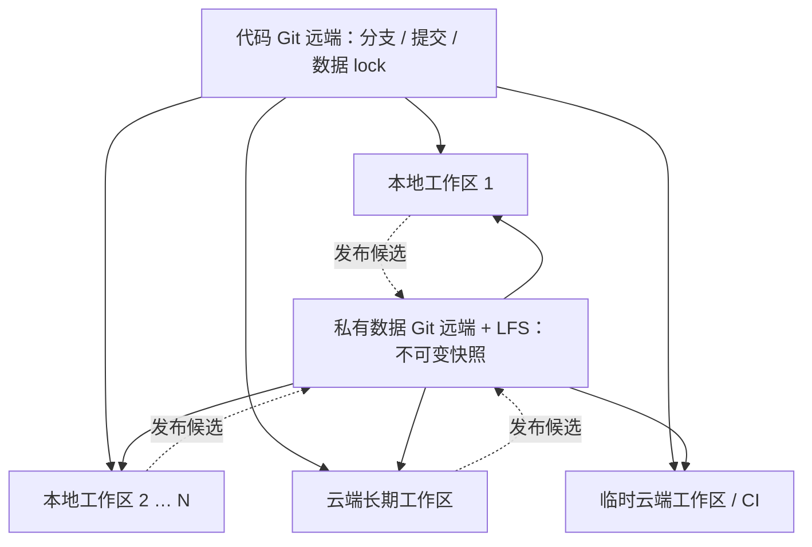

# 多环境协同开发与 Git 数据同步方案

状态：首版本地实现、验收和私有数据发布已完成；Windows／云端验收待完成。日期：2026-10-06。

已实现的命令和接入步骤见[运行手册](../development-data-sync-runbook.md)。本文件保留总体设计；下文验收矩阵是目标，不能视为所有平台已通过。

## 目标与推荐方式

任意数量的开发工作区各自运行 PostgreSQL，通过共同的 Git 远端发布和获取有版本、可校验、可恢复的数据快照。一个工作区可以位于本地电脑、云端虚拟机或临时云端开发实例；同一台机器也可以承载多个隔离工作区。新增环境只需接入共同协议，不需要逐一连接已有机器。

代码提交锁定数据快照；选择同一个代码提交的工作区，应用并通过核验后，应看到相同的图鉴、图片、地图与历史业务记录。每个工作区提供只读数据库查看页，显示正在查看的工作区、连接身份、内容版本、表与记录。

同步以明确的版本交接点为准。只有代码、迁移、业务数据、外部依赖全部核验一致，界面才显示“与目标版本一致”。不同功能分支可以使用不同数据基线；离线工作区可能落后。协议保证同一目标可复现，并通过状态明确标识偏差，不要求所有开发者同时停在一个版本。浏览器选中项、窗口大小和滚动位置不属于共享开发数据。

## 工作区、版本与协作关系

环境能力的唯一文档入口为[开发环境与能力登记册](../development-environments.md)。它集中记录机器／云端实例的稳定标签、职责、资源、工具、限制、核验时间及推荐任务。各环境可以具有不同的原始资源；同步目标是匹配代码版本的业务状态，完整客户端或三个元数据仓库无需安装在所有工作区。开始任务及出现环境缺项时先读取登记册，再决定在哪个环境完成相应步骤。

登记的 `environment_id` 与实例 `workspace_id` 分开：前者指向可推荐的环境能力，后者标识一次实际开发工作区。新工作区关联所属环境标签，状态报告可附该标签；数据库身份仍独立生成。能力登记是推荐依据，实际执行前还需重新核对版本与可用性。

| 概念                  | 含义与边界                                                                                          |
| --------------------- | --------------------------------------------------------------------------------------------------- |
| 工作区 `workspace_id` | 一份隔离的 checkout、运行配置、数据库与开发服务；首次准备时生成唯一 ID，重建实例重新生成            |
| 部署配置 `profile`    | `local`、`cloud-vm`、`ephemeral` 等运行方式；描述磁盘、端口、凭据获取与生命周期，不改变业务数据身份 |
| 运行用途／数据类别    | 沿用 development、local-review、test 等现有合同；云端位置不等于 production 用途                     |
| 代码分支与提交        | 分支表达协作方向，精确 commit 表达一次可复现状态；每个分支使用自身提交内的 lock                     |
| 数据快照              | 不可变的业务状态，由 manifest 与内容摘要标识，可以被任意数量的工作区使用                            |
| 数据基线              | 选定代码提交中的 lock 指定的快照；main 提供团队默认基线，功能分支可声明自己的候选                   |
| 应用记录              | 某工作区实际应用了哪个目标、实际摘要、核验时间与结果；保存在该工作区，不充当其他环境的实时状态      |



图中的每个工作区都拥有独立的数据库身份、凭据和活动数据清单。默认只读的 CI 消费已批准快照；被授权的开发工作区才可发布候选。工作区之间无需互通数据库端口。

同一工作区内多个 AI Session 继续遵守现有共享工作台规则；跨工作区通过 Git 协作。单机文件锁只协调该工作区，跨环境的竞争由远端分支更新和基线检查处理。

## 本地与云端运行方式

| 运行方式           | 首版建议                                                               | 需要验证的条件                                                         |
| ------------------ | ---------------------------------------------------------------------- | ---------------------------------------------------------------------- |
| macOS / Linux 本地 | 独立 checkout、受管本地 PostgreSQL、私有状态目录                       | 当前工具链、Docker、资源容量和数据库合同                               |
| Windows 本地       | WSL2 中运行 Node、Git 和命令，使用 Docker Desktop                      | POSIX 脚本、文件权限、进程管理与游戏路径映射；原生 PowerShell 尚未验证 |
| 长期云端 VM        | 同一 VM 内运行开发服务和受管 PostgreSQL，数据库仅绑定该 VM 的 loopback | 身份由云端实例独立生成、私有凭据注入、持久磁盘与受控浏览器入口         |
| 临时云端实例 / CI  | 按指定代码提交重建，默认只读获取快照，每个任务独立数据库               | 必要的容器能力、磁盘配额和来源可访问性；实例销毁前保存需要保留的工作   |

云端第一阶段采用与现有合同相容的同机 PostgreSQL 拓扑。多容器环境若不共享 loopback、或采用云托管 PostgreSQL，必须另立网络与身份适配 ADR，覆盖 endpoint 校验、TLS、凭据分发和恢复能力；当前非 production 合同仅允许 loopback，不能通过把环境改为 production 绕过。无法提供受管数据库能力的云端平台应明确显示不支持，不假定所有云端实例均能运行 Docker。

同一主机承载多个工作区时，状态目录、Docker project／volume、协调锁和端口均按工作区隔离。单个默认工作区继续使用 `127.0.0.1:3000`，更多工作区由受管启动器分配端口并记录 origin；端口不作为数据库身份。已实现工作区 UUID、独立候选 Docker project／volume 与自动端口选择；第二个工作区需先运行 `data:workspace` 再同步。

## 当前项目的实际约束

| 已有事实                                                               | 对方案的影响                                                             |
| ---------------------------------------------------------------------- | ------------------------------------------------------------------------ |
| 代码仓库 `CharlesLiuyx/Medota2` 为公开仓库                             | 大型数据和未获准再分发的资源不能直接进入代码仓库                         |
| `asset_blobs.content` 保存图片二进制，包含多档 LoD                     | 只同步表结构或重新导入英雄数据无法复现当前图片                           |
| 单位定义、补充本地化、游戏补丁号仍读取固定 commit 的 Git 对象          | 必须锁定并准备对应外部来源仓库，不能只恢复数据库                         |
| 地图位于忽略目录，入口由 `DOTA_MAP_DATA_PATH` 指定                     | 地图也必须纳入版本清单与内容核验                                         |
| 本机预览会在 development 与 local-review 中自动选择                    | 同步模式必须明确指定目标数据环境，避免不同工作区选到不同库               |
| 身份 receipt 绑定本机实例、数据库、PostgreSQL system identifier 与凭据 | 各工作区需要独立生成身份，不能复制 `.medota2/environments/` 或整个数据卷 |
| 现有数据库连接通过 Environment Contract                                | 导出、恢复和查看工具必须纳入该边界；现有 ADR 0005 不提供 Drizzle Studio  |
| 当前图鉴构建号 6918，Windows 游戏安装声明 6944                         | 新机器的游戏安装不能自动替代锁定版本的来源                               |

设计依据来自 `src/server/db/schema.ts`、`src/development/preview.ts`、`src/server/environment/contract.ts`、[环境合同 ADR](../adr/0005-environment-contract.md)、[地图规范](map-explorer.md)与[单位规范](unit-catalog.md)。首轮本机快照为34张业务表、46,238条记录，表分块与二进制共84,475,984字节；分块目标上限1MiB，单条超限记录保持完整。

## Git 中保存什么

建议使用两个共同的远端仓库：现有代码仓库，以及仅供获准开发者和自动化身份访问的独立私有数据仓库。所有工作区都接入这两个远端。数据仓库地址通过工作区配置指定；公开代码只记录逻辑仓库名、精确数据 commit 和内容摘要。

```text
代码仓库 Medota2
  pnpm-lock.yaml、运行时版本配置
  drizzle/                         数据库结构与迁移
  dev-data.lock.json               固定数据 commit、manifest 摘要、schema 摘要
  数据导出／应用／核验代码

私有数据仓库
  .gitattributes                  仅指定的大文件走 LFS
  snapshots/<snapshot-id>/manifest.json
  tables/<hash>.ndjson             稳定排序的 NDJSON 分块
  objects/<hash>                   图片、地图文件等不可变内容，走 LFS

每个工作区各自保留
  .env、私有 receipt、数据库密码、Docker volume
  数据仓库 checkout、恢复记录、失败诊断和本地备份
```

Git LFS 在 Git 提交中保存指针，实际大文件由 LFS 存储托管，因此必须同时获取 Git commit 和对应 LFS 内容，才能恢复数据。[GitHub 官方说明](https://docs.github.com/en/repositories/working-with-files/managing-large-files/about-git-large-file-storage)。

小型结构化分块使用普通 Git，便于查看差异；二进制进入 LFS。图片按已有 SHA-256 去重，修改一项数据不必重传全部图片。首版先保证完整导出／恢复正确，再按实际体积优化分块，暂不引入常驻复制服务。

**存储许可前置条件：**私有仓库只解决访问范围，不代表已获得上传 Valve 或第三方资源的许可。实施前需要确认允许进入所选存储的资源范围，并调整现有“批量资产不进入 Git”的项目约定。未经确认的资源只在本地保留，清单记录固定来源与哈希，由需要该资源的工作区自行获取；缺少所需内容时必须显示“资源不完整”，不能报告全状态一致。本机已存在 Git LFS；用户已批准首个私有开发快照发布。首个私有数据仓库与上传已完成，资源未加入公开代码仓库；以后扩大资源或存储范围仍需重新核对授权。

## 一致性的定义与版本清单

在同一代码提交上，比较以下内容：

| 比较项     | 核验方式                                                                         |
| ---------- | -------------------------------------------------------------------------------- |
| 代码与依赖 | Git commit、受跟踪文件是否改动、锁文件摘要、运行时版本                           |
| 数据结构   | 按顺序记录全部 migration 文件与 SHA-256，并核对实际 schema；不能只比最后一个编号 |
| 业务内容   | 导出范围内每表行数、稳定编码后的分块哈希及聚合哈希                               |
| 当前数据   | Catalog、英雄／技能资产、单位资产的全部 head 与绑定关系                          |
| 图片和地图 | 实际内容 SHA-256、长度、图片尺寸、地图 manifest 摘要                             |
| 外部来源   | repository、精确 commit、必要文件路径与哈希；核验 Git 对象可读取                 |
| 本地环境   | 各自通过身份／角色权限校验；实例 ID 应不同，不参与业务内容等值比较               |

`dev-data.lock.json` 包含格式版本、逻辑数据仓库名、精确数据 commit、snapshot ID、manifest 哈希、迁移集合哈希、所需运行用途与数据类别。lock 不包含 workspace ID、主机地址、端口或绝对路径，跨本地和云端使用同一份文件。使用 `local-review + production-snapshot` 交接当前真实资料，`development + sandbox` 保留作显式实验环境，测试数据继续走已有隔离测试流程。

manifest 包含导出器版本、兼容 schema、用于导出的代码提交、父快照列表、表／列白名单、各分块哈希和计数、heads、图片／地图／外部来源清单。业务记录原有的 `source_repository`、`source_commit`、`source_path`、`client_version`、`imported_at`、导入器及目标 schema 版本均保留。导出时间单独记录，不参与业务内容摘要；恢复时间只写入本机记录，不能改写来源导入时间。

表内按完整主键稳定排序；JSON 对象键、时间格式、数值与 null 有明确编码，数组顺序保留，bigint/decimal 不经过有精度损失的 JavaScript number。UUID 与历史版本 ID 原样恢复。再次导出无变化的内容应得到相同业务摘要。

## 数据导出与恢复

### 导出边界

首版采用应用级格式：通过已验证的只读事务导出 NDJSON，图片 `bytea` 拆成哈希寻址文件。结构由代码迁移重建，环境身份在目标机器生成。该方式便于审阅内容，并避开搬运原库角色和身份。

导出器必须维护受审阅的表与列清单，覆盖全部已完成业务数据及其历史：来源、Catalog、定义／关系／本地化、资产、版本 head、审阅／回滚、参考比较和被引用的已完成导入记录。恢复完整外键关系，包括循环引用和延后关联。staging、运行中的导入、测试数据、会话日志、身份与迁移执行记录不导出；遇到未识别的新表／列或指向排除记录的引用时拒绝导出，不能静默漏数据。

导出拒绝尚未完成的导入，持有同步命令协调锁；所有表、heads、行数和摘要来自同一个 `REPEATABLE READ READ ONLY` 事务。枚举固定且不可变的地图和源文件依赖，逐项核验。日志和 JSON 字段也要按白名单检查，禁止把连接串、令牌、本机路径或未经审核的未来玩家数据带入快照。

PostgreSQL 原生 `pg_dump` 支持并发使用时的一致性导出与跨架构恢复，可用于本机恢复备份；其归档不直接充当本方案的 Git 数据协议。[PostgreSQL 18 官方文档](https://www.postgresql.org/docs/18/app-pgdump.html)。若后续改用它承担传输，需要另行处理角色、环境身份、表白名单、schema 兼容和合同接入。

### 应用流程

1. **只读预检。**解析代码 lock、目标快照、实际库身份、当前业务摘要及资源可用性。展示候选目标、行数／head 差异和本地未交接改动。
2. **完整准备。**按精确数据 commit 获取内容，检测未下载的 LFS 指针，校验全部哈希；外部来源按固定 commit 准备。所有资源先下载到不可变目录，未完成前不改变当前预览。
3. **恢复到新候选栈。**通过受管 provisioning 创建独立 PostgreSQL 候选栈与本机身份，运行锁定 schema 的迁移，再按受审恢复计划导入。候选栈支持已通过现有 lifecycle 扩展实现。
4. **验证候选。**事务提交前检查外键、唯一约束和 head 关系；恢复后完整核验摘要、图片、来源、角色合同及英雄／技能／单位／地图查询。恢复权限属于受管维护流程，Web 和普通 Worker 不增加清表／覆盖权限。
5. **切换工作台。**持有当前工作区排他锁，停止该工作区的 Web／写任务，通过原子更新该工作区“活动候选”清单同时选择 receipt、数据环境和资源目录，再重启该工作区记录的预览 origin（默认工作区使用 `3000`）。不得逐项手改配置导致数据库和地图来自不同快照。
6. **记录与回滚。**保存本机应用记录和旧栈位置；预览健康检查失败则恢复旧清单并重启。崩溃后依据持久阶段记录继续验证或回滚，不能把半次恢复标为成功。旧栈的清理由单独、明确的操作负责。

目标数据库每次生成独立身份；禁止恢复源库的 `medota2_control`、角色密码、receipt、ACL 和 migration 执行历史。表结构及权限由本地迁移和合同建立。新增 restore 操作见[ADR 0008](../adr/0008-development-snapshot-restore.md)，恢复保持外键和权限检查。

schema 完全一致才允许直接应用快照。当前不提供跨 schema 自动升级／降级；新增迁移前需另行设计旧版恢复与升级流程。已选择的活动快照与当前迁移不符时，工作台启动会停止，避免自动改写所选基线。切回旧代码应使用匹配旧版本的新候选栈。

## 日常交接方式

以下命令已实现；首次远端接入依赖发布完成的 lock 和私有仓库访问权限：

| 命令                     | 预期行为                                                                     |
| ------------------------ | ---------------------------------------------------------------------------- |
| `pnpm data:status`       | 显示代码／数据目标、当前工作区实际摘要、漂移和缺失依赖；完整一致退出 0       |
| `pnpm data:export`       | 生成本地不可变候选与差异摘要，不自动提交或上传                               |
| `pnpm data:apply --plan` | 只读展示指定快照和具体目标环境的应用计划                                     |
| `pnpm data:apply`        | 在已有授权范围内准备、恢复、核验并切换；有未保存业务改动则停止切换           |
| `pnpm dev:sync`          | 编排已拉取代码的依赖核对、data:apply 和工作台重启，不自动处理代码合并或 push |

### 任意环境发布与获取

任何获准的开发工作区完成一次开发后：检查代码 → 导出数据 → 审阅代码和数据差异 → 在授权后提交并推送数据候选 → 从远端验证精确 commit 与 LFS 文件可获取 → 更新所属代码分支的 lock → 在授权后提交并推送代码。两个仓库没有跨仓原子事务，采用“先数据、后引用”的顺序；先上传的未被引用快照可暂时保留。

数据候选使用唯一分支（例如 `snapshots/<snapshot-id>`），内容路径不可改写。代码功能分支各自持有 lock；合入 main 时重新核验目标基线。候选无需争用数据仓库的 main，也不能依赖一个不断变化的 `latest` 文件来决定恢复内容。

任意消费工作区开始工作时：保存当前工作 → 拉取选择的代码分支／提交 → 查看数据差异计划 → 应用 lock 指定的快照 → 核验 → 打开该工作区预览。Git pull 本身不恢复数据库；`pnpm dev` 启动时检查 lock 与实际状态，提示同步或明确标记正在使用本地改动，避免后台覆盖。

版本已一致时，重复应用应直接返回，无需导入和重启。离线且目标文件已经完整缓存时可应用；缺少内容时保留当前环境，标记未同步。工作区可主动跟进 main 或固定某个提交；将来自动跟进也必须显式配置，遇到本地改动时停止切换，不能由其他机器的 push 直接改写当前工作区。

### 并行开发与基线竞争

允许任意数量的工作区从同一基线分支开发，同时发布各自的数据候选。默认 main 的代码 lock 是共享基线的唯一选择点；快照本身不包含一个可被所有环境改写的全局 current head。

每个候选保存基于的代码提交与父快照。发布前重新读取目标分支：只有目标分支仍处于预期提交时，才能在授权下更新；远端变化时，普通非强制 push 或要求最新基线的合并门禁必须拒绝过期发布。即使 Git 没有文本冲突，也要重新检查数据祖先和 schema 兼容，不能把“可自动 merge”视为数据库可合并。具体托管平台的分支保护配置属于实施阶段。

若多个候选在同一基线修改业务内容，保留全部分支，选择已接纳的候选作为新基线，将其他候选的必要导入／迁移逐个重新执行、验证，再生成整合快照。manifest 记录整合时实际采用的父快照及来源；完整数据库快照不逐行 Git 合并，不使用 last-write-wins，不强制覆盖远端。

应用前也必须重新计算当前工作区业务摘要。与上次应用基线不同则先导出保存；未经明确放弃授权，不以远端较新为由丢弃当前修改。保留业务改动后切换、放弃改动、删除旧栈是不同的明确操作。

## 新工作区加入、退出与存储维护

新增第 3、第 10 或更多工作区都执行同一流程，不依赖某一台现有开发机在线：

1. 选择受支持的 profile、代码分支或精确提交，核对运行时、存储和容器能力。
2. 通过环境自身的凭据机制获取代码／数据访问权限；消费身份默认只读，发布身份单独授权。云端密钥不写入镜像、lock 或 Git，禁止继承其他工作区 receipt。
3. clone 代码，按 lock 获取精确数据 commit、必需 LFS 内容和外部来源；无私有权限的公共 PR／CI 只使用 fixture，并明确标为 fixture 验证。
4. 生成独立 workspace ID，准备受管数据库与候选恢复目录，执行应用和全量核验。
5. 输出当前代码、目标快照、实际摘要、查看页地址与核验结果。全部通过后，工作区才可以声明与该目标一致。

云端实例重建后重新生成工作区及数据库身份。可复用按哈希校验的只读内容缓存，不复用旧私有 receipt、密码或活动数据库卷。临时实例结束前需检查代码未推送和数据未导出状态；可控退出流程应阻止静默丢弃，但平台强制回收仍可能丢失未发布内容，Git 同步不提供未发布数据的远程持久性保证。

首版不引入强制中央环境注册服务。每个环境可生成一份无凭据的状态报告，用于比较 workspace ID、代码 commit、目标／实际快照、检查时间与状态；共享该报告需要显式配置。报告是带时间的观察结果，离线、过期和不可达必须显示为未知，不能仅凭大家指向同一 lock 宣称所有环境当前一致。

新环境加入时，同时按登记册模板记录其独有资源、适用任务、限制和验证依据；已有环境工具安装、来源版本或职责改变时更新原条目。集中维护的文档登记册已建立，实时状态收集与自动任务推荐仍为后续能力。当前环境缺少客户端／提取器等条件时，按登记规则输出推荐环境与交接内容，不自动远程调度。

数据 commit 与 LFS 内容至少保留所有受支持代码分支、已发布基线和约定回滚版本引用的集合。不得仅因为某工作区删除了本地快照就删除远端内容；垃圾清理需枚举保留引用、应用保留期并单独授权。云端缓存设置容量上限、按需获取目标版本；上传前展示候选大小，并在存储配额不足时停止发布，避免代码 lock 指向不完整的数据。

## 在本地浏览器查看各工作区数据库

拟在每个工作区的预览 origin 提供 `/dev/database`，由工作台面板提供“数据库”链接。默认本地地址为 `http://127.0.0.1:3000/dev/database`。云端首版通过经过认证的 SSH／平台端口转发映射到浏览器本机的独立端口，后端仍在云端工作区查询该实例的数据库；切换查看入口不会把本地应用改连到远程数据库。页面分成三个区域：

- **环境与同步状态：**workspace ID、可读名称、部署 profile、代码分支、运行用途、数据类别、实例短 ID、代码提交、目标快照、实际业务摘要、上次完整核验时间；清楚显示一致、待应用、本地已改动、资源缺失、检查失败和检查中。
- **业务版本：**Catalog／英雄技能图片／单位图片／地图版本、来源提交与游戏构建号、覆盖数、缺失数；可跳转到产品页面。
- **表和记录：**受控表清单、精确或明确标注为估计的行数、列类型／主外键、分页记录、按允许字段过滤、JSON 展开、图片缩略图及来源信息。

查看页通过现有 `getWebDatabase()` 与只读能力查询，不暴露数据库 URL、密码或 control 表，不接收任意 SQL。表名／列名由白名单映射，值参数化；默认每页 50 行，上限 200 行，查询超时与 JSON 展示长度受限，blob 只通过已有图片路由查看。精确全量哈希在显式核验时执行，普通浏览只展示带时间的已验证结果；不能仅凭旧 receipt 宣称数据库仍一致。

路由及其 API 只在显式开启的开发工作台中存在，生产构建返回 404。本地及云端同机服务均限制 loopback；浏览器入口校验 Host 与同源，端口转发只绑定浏览器机器的 loopback，并对每个工作区使用不同 origin。首版不开放匿名公网数据库查看页。若采用团队共享 HTTPS 网关，需要先补充身份认证、按工作区授权、Origin 策略和审计，并单独验收；公网可达与只读权限不能代替访问控制。以后需要写 SQL 或编辑记录时，另行设计权限与审计。

应用快照后触发目录 head 重新检查及服务器缓存重建；浏览器持久缓存必须核对实际内容版本，不能展示旧快照却标注新版本。验收包含同一浏览器从快照 A 切到 B，再回到 A。

## 实施顺序与验收

1. **协议与可见性。**先建立 workspace/profile、分支数据 lock、状态报告与只读查看页；确认存储和资源范围、测量数据容量。接口不绑定工作区数量。
2. **受管往返。**编写恢复 ADR、表白名单和格式协议，完成本机候选恢复、隔离命名、切换与回滚；故障注入证明旧工作区可恢复。
3. **N 环境交接。**接入获准的数据存储、LFS 和 `dev:sync`；至少用 macOS、Windows/WSL2、Linux 云端 VM 三个工作区验证共同基线与并发候选。
4. **临时环境与扩展拓扑。**验收临时云端重建、只读 CI、缓存与退出流程；托管 PostgreSQL、多容器网络或共享 HTTPS 网关按各自 ADR 逐项接入，不能自动继承已验证结论。

必须覆盖的少量完整流程：

| 场景                                     | 通过条件                                                                             |
| ---------------------------------------- | ------------------------------------------------------------------------------------ |
| A 导出 → B、C 全新恢复 → 各自再导出      | 业务摘要、所有 heads、来源与资产哈希一致；全部工作区实例身份不同                     |
| 全页面浏览                               | 英雄、技能、单位、地图内容及缺图统计一致；不把既有 90 项缺图当作新同步成功的完整图片 |
| B 改动 → 交接回 A                        | 新内容可见，历史版本、来源时间与原有 ID 保留                                         |
| 三个工作区从同一基线并行修改             | 全部候选保留；过期发布被拒绝；基线整合后各端可收敛                                   |
| 缺 LFS 文件／哈希错误／缺来源 commit     | 在切换前失败，当前工作台仍可用                                                       |
| 不匹配 schema／权限漂移／复制旧 receipt  | 拒绝应用，不放宽环境合同                                                             |
| 导出中途存在写入、恢复中断、切换进程崩溃 | 导出内容来自同一事务；恢复失败不污染活动库；切换可恢复                               |
| 重复应用和跨版本切换                     | 相同快照无重复导入；A → B → A 的服务端及 IndexedDB 内容正确                          |
| 数据库查看页                             | 分页、过滤、JSON 与图片可读；未知表／SQL 输入被拒绝；生产入口不可用                  |

追加的多环境验收：

| 场景                        | 通过条件                                                                    |
| --------------------------- | --------------------------------------------------------------------------- |
| 新增工作区 D，原发布者离线  | 仅凭共同远端和必要来源就能恢复选定基线，无机器对机器依赖                    |
| 两个分支选择不同快照        | 各自对本分支目标核验通过，不被默认 main 的状态误判为一致或错误              |
| 同一主机启动多个工作区      | 状态、端口、锁、卷和数据库身份不冲突，停止一个不影响另一个                  |
| 云端重建、临时实例和只读 CI | 身份独立重建；只读身份不能发布；无私有权限时明确使用 fixture                |
| 云端数据库查看              | 本地浏览器经认证转发可浏览指定工作区，origin 隔离；未经认证的远程访问不可用 |
| 长期离线与过期报告          | 保留离线内容；报告注明时间与未知状态；联网后按目标核验                      |
| 旧版本回滚与存储清理        | 受支持基线的 Git 和 LFS 内容仍可获取；删除单个工作区不会破坏他人恢复        |

实现按变更范围运行 `pnpm check --plan` 与 `pnpm check`，数据库合同修改加入现有隔离合同用例。各 profile 和多环境流程实际验收完成前，只能报告已验证的环境与范围。新增平台需通过相同契约验收，无需修改快照协议。

本提案交付的是开发方式设计。数据同步命令、数据仓库、恢复生命周期与数据库查看页均尚未创建，后续实施按以上顺序推进。
