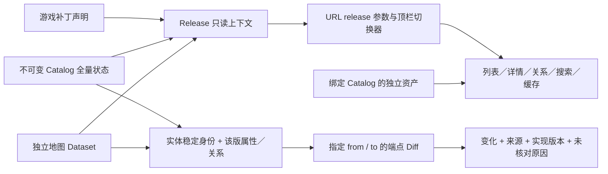

# 实体版本与语义变化

状态：2026-10-07 架构与7.41e／7.41f两版完整收录已实现。目标与后续完整验收见[实施任务](../work/entity-version-diff.md)。本合同替代 Catalog／ADR0001 中“产品仅查询 current head”的入口限制，原子 Catalog、来源和刷新门禁仍适用。

## 版本与完整状态

Release 是可查询的组合读上下文，不是新数据库 head，也不代表统一的客户端构建号。每个 Catalog 发布版本形成 `c:<dataset UUID>`；产品版本统一收录英雄、技能／天赋、命石、关系、本地化、单位定义与图片状态，以及有依据的地图对象／区域和资源。独立地图仍是来源Dataset；历史 `m:<collection ID>` URL在唯一完整Catalog对应时规范化到该Catalog入口，顶栏只显示完整版本。仅地图输入只供独立地图验证工作台使用，不作为产品版本。多个 Catalog 即使游戏补丁或客户端构建相同仍保持独立版本。

Catalog 的补丁标签复用固定 commit 与 steam.inf checksum 校验后的 change_log 解析；缺少证据为未知。地图补丁取 Collection 的声明。只有同补丁且恰有一份地图时关联两者；这表示补丁范围对应，**不认证两者客户端字节相同**。重复地图、补丁未知或地图缺失保留原因，绝不选择“最近”的另一份资源。地图与 Catalog 构建号分别返回。

顶栏在所有实体页面生效。无 `release` 的入口先重定向到当前默认的显式版本；未知、空或重复参数返回404。动态根布局不对整个页面套流式Suspense，保留真实404状态和生产开发入口隔离；URL客户端上下文在动态请求中读取。URL可分享恢复；不同标签页各自选择，浏览器不使用共享cookie或localStorage改变页面版本。旧地图链接进入对应完整版本；没有唯一对应关系时明确返回不可用。

Catalog head只选择默认入口，已发布历史版本不会被显式查询覆盖。公共入口仅暴露曾发布、非Red且审阅通过／无需审阅的版本；未发布候选继续走导入Review。列表API兼容原有固定Catalog／asset成对参数，并支持 `release`；两套参数冲突返回400，缺少图鉴覆盖返回410。

## 实体与跨版本身份清单

实体身份是跨快照匹配的证据，不包含版本ID；状态存储主键仍包含所属Dataset。

| 对象         | 跨版本匹配与属性                                     | 关系／附属资料                                 | 当前覆盖与边界                                                                                         |
| ------------ | ---------------------------------------------------- | ---------------------------------------------- | ------------------------------------------------------------------------------------------------------ |
| 英雄         | internal_name；数值hero_id、slug、基础属性是版本状态 | 角色、技能槽位、天赋、命石、本地化、图片       | Catalog完整快照；改名／ID映射不自动推断，保留增删与来源供审阅                                          |
| 技能与天赋   | internal_name；数值ID可多值，不作为主键              | 数值项、修饰条件、英雄／命石绑定、本地化、图片 | Catalog完整快照；标量、每级数组及modifier保留                                                          |
| 命石         | hero_id＋facet_key                                   | 命石→技能关系、原始定义及来源行                | Catalog完整快照；英雄ID变化涉及对应关系待核对                                                          |
| 单位定义     | internal_name；类别、模型、基础数值、变体            | 单位技能、来源与本地化                         | 固定Catalog commit只读模型，原始KV保留；未持久化独立Unit Dataset，缺来源不可比较                       |
| 属性         | 审阅后的语义ID；未知参数按类型＋对象＋字段隔离       | 英雄／技能／单位／物品同版引用、机制说明与证据 | 只读投影，URL固定Release；公式只适用审阅提交，通用机器Diff待接入，见[属性](attribute-catalog.md)       |
| 物品定义     | internal_name；价格、数值、分类                      | 配方、成品、双语说明                           | 固定Catalog commit只读模型；目录／详情保持Release，通用机器Diff投影尚未接入，见[物品](item-catalog.md) |
| 地图对象实例 | 唯一sourceClass＋targetname／volumename              | 坐标、阵营、类、属性与来源                     | 仅可比较可靠匹配对象的属性；匿名／重复对象不推断增删。实例不能直接当单位定义                           |
| 地图区域     | 当前提取顺序生成的区域ID                             | 营地多边形与高度边界                           | 稳定身份未核验，结构原文可见，语义比较明确不可用                                                       |
| 关系         | 类型＋两端＋槽位等稳定复合键                         | 顺序、当前状态、条件与来源行                   | hero→ability、facet→ability、数值ID映射与角色；两端变化为移除旧关系／新增关系                          |
| 本地化       | 对象＋locale                                         | 名称／介绍／说明／来源token                    | 已持久化Catalog文本可比较；运行时补充文本仍由固定来源验证，未声称全部持久化                            |
| 图片绑定     | 实体类型＋key＋asset_kind                            | 内容hash、路径、解析状态、独立图片来源         | 同Catalog对应资产；图片变化与游戏数值分开，不使用其他Catalog图片补缺                                   |
| 机制与规则   | 已解析技能modifier键、地图成长规则键                 | 结构化条件／效果与原始依据                     | 仅已识别规则，新增脚本与引擎逻辑不自动解释；未知项原文保留并标待核对                                   |
| 来源结构     | 来源实体／出现序号，或单位／地图原文记录             | 原始KV、未知键、坐标结构、checksum             | 原始变化可追溯；身份、覆盖不足不能解释成“没有变化”                                                     |

重命名、标识复用、拆分、合并目前没有可靠映射表，禁止模糊名称／坐标距离自动合并身份。后续加入映射须记录from/to实体、来源依据与人工决定。地图来源切换也需核验稳定对应关系。

## Diff 合同

- `GET /api/releases` 返回收录版本及独立覆盖、默认入口；`GET /api/releases/diff?from=…&to=…` 返回结构化比较；`/changes?release=…&from=…` 是浏览页面。起点任意已收录版本，终点随顶栏；按对象／变化类别及名称筛选，每页25个分组；中文前后值常显，原始字段和证据可展开。
- 两个**完整端点**直接比较，不累加中间事件；A→B→C中暂时新增后撤回、属性修改后还原不会出现在A→C最终差异。相邻及非相邻使用同一实现；同一版本重复计算稳定。
- 变化包含版本对、Diff实现版本、实体类型与key、entity/property/relation/mechanism/source_structure类别、增删改、JSON Pointer字段路径、前后值、双方来源以及待核对原因。数组作为有序属性整体比较；字典递归按字段比较。KV 对象先去除来源行号与唯一键顺序，重复键保留出现顺序；行号／路径仍保留在来源证据中。文件声明关系按英雄＋技能匹配，文件路径及声明行号不作为游戏关系变化。绑定ordinal可能保存来源行，统一去除；真实槽位仍由source_slot参与身份与状态比较。
- 未出现使用 `absent`，显式null使用 `value:null`，不会混淆。完整来源中实体不存在才判断新增／删除；来源缺失或身份规则不兼容为incomparable；部分来源仅比较已可靠匹配的状态，未匹配项列为unresolved。解析错误使请求失败，不能伪装成空快照。
- 全部覆盖可比且无变化为unchanged，有变化为changed；全部不可比为incomparable；有部分缺项、身份歧义、未知结构或实现变化为partial，同时保留已确认变化。
- 导入器、schema、单位适配器、地图导入器、经济算法版本分别记录在implementation；变化单独返回并使游戏归因需要复核，不能将Medota2实现升级当作游戏补丁。
- 原始未知结构保留内容和来源，结果列待核对；机制只报告已解析条件与效果，不声称具备完整引擎逻辑Diff。地图区域与完整脚本机制是下一阶段。

## 玩家可读变化与官方说明

变化页按英雄及其技能／天赋、物品／附魔组织，正文使用同端点中文名称、已知属性语义及“之前 → 之后”。每级数值保持顺序、去除小数尾零，百分比／秒采用同版数值条目的display_type、本地化或明确字段规则；天赋文本分别用前后端点的modifier数值解析。天赋换位保留移出／加入及各端点实际等级。数值的level_values／scalar_value及重复机制投影合并为一行，所有证据仍附在该行；筛选核对该行全部原始记录。

`src/presentation/entity-changes.ts`只负责无副作用展示。`src/server/services/release-changes.ts`复用请求内两个完整快照与经hash核验的同版本本地化，批量建立名称／归属索引，组合官方说明；不修改机器Diff API、发布指针或数据库。未知含义、解析差异和原始结构在页末折叠，不替代为无变化。比较范围、全部未匹配记录及原文有分页入口。

官方补丁说明是独立的说明来源。`src/data/patch-notes/7.41f.json`保存重排后的事实描述、来源URL／完整响应hash／导入时间、名称映射的固定提交和文件hash，以及已测量的物品定义差异。当前说明只绑定已审阅的7.41e／6918到7.41f／6944固定提交对，防止反向、同版、非相邻端点或同补丁其他构建误用。官方文字与两端数值并列，不以同名对象的说明自动认证每个字段；未得到可读数值差异的说明明确待核对，行为修复提示需脚本／引擎验证。物品补充来自同提交原始KV报告，反向比较交换值与来源，官方说明仍只用于正向更新；未声称持久化了物品Catalog。

后续更新先获取并校验对应官方说明，固定来源URL／hash／时间，核对ID到同提交实体名称的唯一映射，生成有版本边界的说明数据；在完整版本收录后关联。不得在玩家请求时抓取外部最新内容，也不得给未知字段自动匹配相似官方描述。保持官方事实、实际数值与来源实现变化各自可追溯。

## 存储、导入与同步

复用不可变全量Catalog和地图包，不新增迁移或改写旧migration。未变化实体在新版完整快照中照常存在；旧记录与来源不删除。版本索引与Diff为派生只读投影，回退代码不需要回滚业务数据。

每次新版本先创建完整候选，准备英雄／技能资产、同提交单位定义与完整单位图片状态、双语本地化、命石／关系、同提交物品定义及完整图片，以及同补丁唯一地图及其资源／routing校验。已知地图客户端构建须与Catalog一致；历史未知构建保留未知。`inspectReleaseReadiness`统一核对；自动导入与显式提升都受此门禁约束，缺项候选不能成为默认版本。来源查找顺序为配置的固定worktree、本机固定commit缓存、配置外部输入，各读者继续核对精确commit与记录hash。

实际更新仍按[刷新门禁](../adr/0003-catalog-refresh-gates.md)生成候选、校验、审阅、提升；首次导入与资产准备见[导入手册](../operations/catalog-import.md)。公开历史浏览不意味着批准候选。下一次更新需要保留每个Catalog来源commit和匹配资产，不能覆盖旧来源或修改当前记录。

完整开发快照既有导出覆盖所有业务表记录、source_snapshots／source_snapshot_files及全部地图Collection；collectSources逐版本保存固定Git对象与运行时文件。派生索引与Diff随相同来源重建，无新增同步schema。跨机器一致性仍需在下一次真实多Catalog快照发布／消费时核验，当前只读检查不能代替这项验收。

缓存身份已包含Catalog＋asset＋语言＋环境；显式版本关闭current-head自动切换，搜索、语言、清空、详情跳转及预取均保留URL版本。未指定版本API仍支持读取head作为默认；版本化来源与图片各自沿用原有验证。

## 验证范围

三个明确标为synthetic-fixture的端点验证不变状态、字段改动、新实体、关系与机制、撤回／还原、无变化／不可比较、未知结构、重复身份和实现版本变化。真实浏览核对统一顶栏、地图覆盖、目录／详情／技能跳转、搜索清空、URL恢复及非法版本。

本机7.41f已按用户完整收录指示记录Review并提升，7.41e历史保留；未发布远端业务快照。真实三版本、单位持久化、完整机制解析、地图区域稳定身份及跨机器多Catalog往返验收仍见[任务](../work/entity-version-diff.md)。
