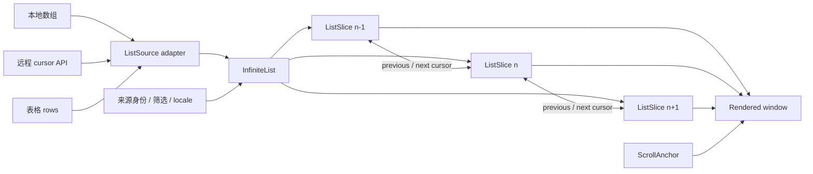

# 全局 List 无限滚动与 3× 预加载 Spec

> 状态：已实现并通过验收
>
> 最后更新：2026-08-31
>
> 目标版本：Medota2 Global Infinite List v1
>
> 上位合同：[Medota2 Design System](../design-system.md)
>
> 技术方案：本文同时定义产品、查询与前端实现合同
>
> 首批消费者：[Hero Catalog v2](hero-catalog-v2.md)
>
> 取代范围：全产品所有 List 的分页或一次性 DOM 全量渲染合同，包括 Hero Catalog v2 §13 与历史 MVP 中“不实现无限滚动”和“Heroes 一次返回全部”的加载合同

## 1. 文档目的

Medota2 的所有 List——无论是远程查询结果、本地已有数组、卡片网格、关系记录、审计记录还是表格行——统一使用无限滚动与惰性渲染，不再用“上一页 / 下一页”、页码或 `page x / y` 切断浏览，也不因集合当前较小就绕开共享行为。用户沿页面文档流持续滚动；接近已加载或已渲染范围任一端时，系统在可见区上方和下方各提前三个 viewport 加载或恢复内容。

本需求属于全局集合浏览的执行切面。它不改变 Hero、Ability、Facet 或来源记录的领域定义，也不改变 VPK SSOT、Catalog 原子版本和 provenance 边界。目标是把同一套持续浏览语法沉淀为 Design System 级『InfiniteList』：Catalog 只是远程 cursor 适配器之一，详情页的本地有界集合和表格行同样消费该基座。不能只删除 `/abilities` 截图中的分页按钮。

最可能的后续演化方向：更多 List 呈现形态、更多远程实体、可切换排序、从搜索/详情返回时精确恢复锚点。本文在 source adapter、cursor、快照身份、行语义和滚动锚点上预留这些扩展点。

## 2. 目标与非目标

### 2.1 目标

- 全产品每个 List 统一使用连续、双向、惰性加载或惰性渲染的『InfiniteList』。
- 远程 List 使用 cursor source adapter；本地数组使用 local source adapter；表格使用保持原生 row/header 语义的 table adapter。
- 可见区上下各 `3 × viewport height` 是空间预取合同，不等同于固定条数或固定 chunk 数。
- 首屏仍由 Server Component 输出可读内容；后续 chunk 才由浏览器请求。
- 下滚可持续取得后续结果；向上滚可恢复已回收的 DOM，并在从中段恢复时取得前序结果。
- 滚动期间固定同一个 Catalog 与 asset dataset，避免版本撕裂、重复和漏项。
- 长距离滚动时保持 DOM 有界；离开预取带的 chunk 用等高 spacer 替代，返回时再恢复。
- 搜索、筛选和 locale 仍写入 URL；分页位置不再作为用户可见 URL 状态。
- 自动加载失败时保留已显示内容并提供原位重试，不让列表整体失效。

### 2.2 非目标

- 不改变 Hero/Ability 业务字段、导入器、数据库 schema 或发布门禁。
- 不引入 Redux、Zustand、TanStack Query 或第三方虚拟列表依赖。
- 不强迫天然有界且已随详情取得的集合新建网络 API；它们使用 local adapter，但仍必须惰性分块渲染。
- 不支持任意跳页、页码输入或“最后一页”捷径。
- 本期不承诺跨浏览器会话保存滚动位置；同一浏览历史中的详情往返必须可恢复。

## 3. L1 概念层

| 概念           | 别称                     | 解释                                                                                                                          |
| -------------- | ------------------------ | ----------------------------------------------------------------------------------------------------------------------------- |
| 【List】       | Collection / 列表        | 任何按稳定顺序重复呈现同类 item 的内容集合；可来自远程查询或本地数组，可呈现为卡片、行、网格、关系记录或审计记录。            |
| 【可视窗口】   | Viewport                 | 浏览器文档视口；本需求不创建嵌套滚动容器。一个 viewport 的高度以当前根视口为准。                                              |
| 【预取带】     | Prefetch band / Overscan | 可视窗口向上 `300vh`、向下 `300vh` 扩展后的区域；边界进入该区域即加载或恢复。                                                 |
| 【数据窗口】   | Chunk / Slice            | 一次从 source adapter 取得的有界连续片段；远程片段带双向 cursor，本地片段使用数组边界。                                       |
| 【渲染窗口】   | Rendered window          | 当前真正挂载到 DOM 的 chunk 集合；至少覆盖上 3 屏、当前屏和下 3 屏。                                                          |
| 【滚动锚点】   | Scroll anchor            | prepend、DOM 回收或历史恢复前后用来保持同一视觉位置的稳定实体及像素偏移。                                                     |
| 【来源适配器】 | Source adapter           | 把 remote cursor、本地数组或 table rows 统一投影为 slice 的内部接口。                                                         |
| 【快照固定】   | Snapshot pinning         | 对有版本身份的远程 List，一次滚动会话内全部 chunk 都读取同一 Catalog dataset 与 asset dataset；不适用的本地 List 不伪造身份。 |

### 3.1 概念账本

| 概念                                            | 可见性                     | 披露时机                           | 先验来源             | 学习迁移                                                           |
| ----------------------------------------------- | -------------------------- | ---------------------------------- | -------------------- | ------------------------------------------------------------------ |
| 持续滚动                                        | 用户可感知，不新增 UI 名词 | 用户滚到任意 List 边缘时自然发生   | 常见信息流与搜索结果 | Catalog、详情、表格及未来 List 一致                                |
| 加载 / 重试 / 已到底                            | 用户可见状态               | 远程请求进行、失败或真正到达边界时 | Web 列表通用反馈     | 所有远程 List 同一位置与语义；小型本地 List 不额外显示“已到底”噪声 |
| source adapter、cursor、chunk、spacer、快照固定 | 仅内部                     | 不向用户解释                       | ——                   | 工程共享                                                           |

本篇不要求用户学习新操作；用户可见的新概念数为 0。系统只复用“继续滚动”和“失败后重试”的既有 Web 先验。

## 4. L2 对象层

| 对象              | 等价别称                       | 定义                                                                            | 本体化（等价条件）                                                                    |
| ----------------- | ------------------------------ | ------------------------------------------------------------------------------- | ------------------------------------------------------------------------------------- |
| 『InfiniteList』  | Infinite collection / 无限列表 | 以统一状态机持续呈现 item 的 Design System 一等能力，与数据来源和视觉形态解耦。 | source identity、item identity 函数、顺序与呈现 adapter 全部相等时，视为同一个 List。 |
| 『ListSlice』     | Chunk / 数据窗口               | 『InfiniteList』中一段有界、连续、可向前或向后衔接的 items。                    | List 身份相同，且首尾稳定 key 与方向相同。                                            |
| 『ListSource』    | Local / Remote / Table adapter | 提供初始 slice 与前后 continuation 的来源适配器。                               | kind 与 source identity 相等时为同一来源。                                            |
| 『CatalogCursor』 | Opaque cursor                  | Remote Catalog source 中指向稳定排序边界的服务端生成令牌。                      | cursor 版本、实体类型、dataset、筛选指纹、locale 与排序 tuple 全部相等。              |
| 『ScrollAnchor』  | 滚动锚点                       | 当前视觉位置所依附的实体 key 与相对 viewport 的像素偏移。                       | 流身份、实体 key 与像素偏移相同。                                                     |

这些对象只服务查询与交互，不成为可保存、分享的产品实体。Hero、Ability 及其他业务对象的本体定义保持不变。

## 5. L3 关系层



- 『InfiniteList』`1→1`『ListSource』、`1→*`『ListSlice』；remote slice 由 cursor 连接，local/table slice 由稳定数组区间连接。
- Remote Catalog 『ListSource』`1→1` Catalog dataset，且 `1→1` asset dataset；dataset 身份属于来源，而不是单张卡片。
- 『Rendered window』是『InfiniteList』的表现切面，不是第二份 List；回收 DOM 不改变数据顺序或原生语义。
- `{加载方向}{请求 cursor}{请求状态}` 属于流与 slice 边界的关系属性。
- `InfiniteList` 是共享 Trait：首学点为任一 List 的自然滚动；复用点为目录、详情关系、审计项、表格和未来集合，零新教学、同一交互。
- 卡片、网格、普通行、`table`、`dl` 是同一 List 的呈现切面；视觉组件不得各自重写加载状态机。
- 过滤器选项、导航 tabs、单个 badge 内的枚举摘要和纯装饰重复元素不是内容 List，不得因为使用 `.map()` 就套用无限加载。

## 6. 全局适用范围清单

| 页面 / 集合                                                        | 分类                       | v1 行为                                                                                                                  |
| ------------------------------------------------------------------ | -------------------------- | ------------------------------------------------------------------------------------------------------------------------ |
| `/heroes` Hero 结果                                                | 远程卡片 List              | 必须迁移到共享『InfiniteList』remote adapter；服务端按属性 rank + HeroID 稳定排序，跨 chunk 保持四属性分组与完整组计数。 |
| `/abilities` Ability 结果                                          | 远程卡片 List              | 必须迁移到同一 remote adapter；删除分页 UI、页码文案和 `page` URL 输出。                                                 |
| Hero detail 的普通 Abilities、Talents & Upgrades                   | 本地关系卡片 List          | 使用 local adapter 分块惰性渲染；保持 section 与 link 语义。                                                             |
| Hero detail 的 Facets                                              | 本地卡片 List              | 使用 local adapter；数量很小时可能因完整落入 3× 预取带而立即渲染，这是空间合同的正常结果。                               |
| Hero detail 的 roles、source files、localizations、reference diffs | 本地审计 / 定义 List       | 全部接入 local adapter；`dl`、row 与 disclosure 语义不变。                                                               |
| Hero detail 的 StatGroup rows                                      | 本地 definition List       | 使用 headless/local adapter，继续输出合法 `dl > div > dt/dd` 结构。                                                      |
| Ability detail 的 AbilityValues                                    | 本地 table row List        | 使用 table adapter；继续输出原生 `table/thead/tbody/tr/th/td`，sentinel 与 spacer 使用合法跨列表格行。                   |
| Ability detail 的 Hero bindings、raw occurrences                   | 本地关系 / disclosure List | 使用 local adapter；完整数据仍随详情 SSR，不另建 API。                                                                   |
| Ability detail 的 numeric IDs、unknown fields、行为或状态枚举      | 本地紧凑 List              | 接入 local/headless adapter；可保持 inline/wrap 呈现，不把每个 badge误报为独立流。                                       |
| Design System 中用于展示 List 组件的动态样例                       | 本地示例 List              | 使用同一 local adapter，以便画廊覆盖 loading、error、empty、end 和 spacer 状态。                                         |
| 导航 tabs、筛选 options、语言选择项、单卡内部固定 badge/role 摘要  | 控件选项或单实体属性       | 不属于内容 List，不创建滚动状态机。                                                                                      |

任何新的内容集合默认属于『InfiniteList』，不以“当前只有几项”为例外。若结构不能使用包装组件（例如严格 table/dl 内容模型），必须使用同一 headless controller / source adapter，而不是绕开状态机。唯一例外是导航、表单选项和单实体内部不可独立浏览的属性摘要；例外必须在对应 Spec 中说明。

## 7. L4 状态与属性层

### 7.1 流属性

| 属性                                | 来源                                     | 动态性 / 约束                                                                         |
| ----------------------------------- | ---------------------------------------- | ------------------------------------------------------------------------------------- |
| `{listKind}`                        | 消费者                                   | card / row / grid / table / definition / disclosure；只影响合法呈现，不改变加载语义   |
| `{sourceKind}`                      | adapter                                  | `remote` / `local` / `table`；同一 controller 接口                                    |
| `{sourceIdentity}`                  | 本地集合身份，或规范化筛选、locale、排序 | 变化即创建新 List，旧响应不得并入                                                     |
| `{catalogDatasetVersionId}`         | Remote Catalog 首屏 meta                 | 仅 Catalog source 使用；会话内固定                                                    |
| `{assetDatasetVersionId}`           | Remote Catalog 首屏 meta                 | 仅 Catalog source 使用；会话内固定；图片路由必须真实按该版本读取                      |
| `{previousCursor}` / `{nextCursor}` | remote source                            | opaque；边界耗尽时为 `null`；local/table source 使用数组区间                          |
| `{prefetchMargin}`                  | Design System                            | 上下固定 `300vh`，resize 后按新 viewport 生效                                         |
| `{chunkLimit}`                      | source 合同                              | remote 由服务端固定上限；local/table 使用组件默认值或受控值，不按 viewport 猜固定条数 |
| `{renderedChunks}`                  | 浏览器测量                               | 只保留预取带内 chunk、可见焦点所在 chunk 与锚点所需 chunk                             |
| `{measuredHeight}`                  | ResizeObserver / 实际布局                | DOM 回收后生成等高 spacer，避免滚动条跳变                                             |
| `{anchor}`                          | 浏览器                                   | prepend、恢复和回收前后校正；#伏笔：跨会话恢复                                        |

### 7.2 状态机

| 状态                   | 进入条件                                        | 退出条件                 | 可见反馈                                                        |
| ---------------------- | ----------------------------------------------- | ------------------------ | --------------------------------------------------------------- |
| `<initial>`            | 首屏 SSR                                        | hydration 完成           | 首批 items 立即可读，原生 list/table/dl 语义完整                |
| `<idle>`               | 当前预取带已填满                                | 任一 sentinel 进入预取带 | 无额外噪声                                                      |
| `<loading-before>`     | 顶部边界进入上方 300vh 且 source 尚有前序 slice | 成功 / 失败 / 取消       | Remote 显示顶部非阻塞 loading，`aria-busy=true`；local 直接恢复 |
| `<loading-after>`      | 底部边界进入下方 300vh 且 source 尚有后序 slice | 成功 / 失败 / 取消       | Remote 显示底部非阻塞 loading，`aria-busy=true`；local 直接展开 |
| `<error-before/after>` | 对应请求失败                                    | 原位重试成功或流身份变化 | 保留现有项、显示方向明确的重试                                  |
| `<start/end>`          | previous / next cursor 为 `null`                | 流身份变化               | 末端只显示一次完成状态；起点不占视觉空间                        |
| `<empty>`              | source items / 初始 total 为 0                  | source 身份变化          | 仅显示对应 Empty state，不启动 observer                         |
| `<stale>`              | dataset/cursor/筛选身份不匹配或历史版本不可用   | 自动重置到当前流         | 清楚提示并安全重置，绝不混合数据                                |

上下方向允许并行，但每个方向最多一个 in-flight 请求。同方向 cursor 只消费一次；错误不是终点。

## 8. L5 行为合同

| 模式 / 状态     | 激活条件                                                                                      | 功能                                                      | 结果与反馈                                               |
| --------------- | --------------------------------------------------------------------------------------------- | --------------------------------------------------------- | -------------------------------------------------------- |
| 初始浏览        | 打开含 List 的页面或 source 变化                                                              | SSR / 初始 local slice，随后观察上下边界                  | 无 skeleton 替换首屏内容                                 |
| 向下预取        | 底部 sentinel 与运行时 `rootMargin: ${3 × viewportHeight}px 0px` 相交 `&& nextCursor != null` | 请求 after slice；若追加后边界仍在预取带，继续串行补齐    | 连续追加，不抢焦点                                       |
| 向上预取        | 顶部 sentinel 与同一 root margin 相交 `&& previousCursor != null`                             | 请求 before slice或恢复已缓存 chunk                       | prepend 后用 ScrollAnchor 校正，无视觉跳跃               |
| Local 向下展开  | local/table slice 的底部边界进入下方 300vh                                                    | 从本地数组取得下一 slice                                  | 不发网络请求，但与 remote 使用同一 reducer/去重/渲染窗口 |
| Local 向上恢复  | spacer 或前序 local 边界进入上方 300vh                                                        | 从本地缓存恢复前序 slice                                  | 保持锚点与原生语义                                       |
| DOM 惰性恢复    | spacer 进入任一方向 300vh 预取带                                                              | 用 source 缓存数据恢复真实 chunk                          | spacer 高度被实测内容替换                                |
| DOM 回收        | chunk 完全离开上下 300vh `&&` 不含焦点 `&&` 不是当前锚点                                      | 记录高度并换成 spacer                                     | DOM 节点数不随总浏览量线性增长                           |
| Source 身份变化 | 新 URL、筛选、locale 或本地 items 身份生效                                                    | abort 旧请求、提升 generation、清空旧窗口、回到新结果顶部 | 旧响应即使晚到也被丢弃                                   |
| 请求失败        | fetch、解析或身份校验失败                                                                     | 保留 cursor 和已显示项；展示“重试加载更早/更多结果”       | 重试从同一 cursor 继续                                   |
| Observer 不可用 | 浏览器无 IntersectionObserver                                                                 | 用 scroll + resize 的同等 300vh 边界检查降级              | 仍为自动连续加载                                         |
| 辅助操作        | 自动加载错误或用户主动触发                                                                    | 提供非分页式“继续加载 / 重试”按钮                         | 不出现页码或前后页                                       |
| 页面 / 详情往返 | 从任意 List item 进入下级页面后浏览器返回                                                     | 优先复用 mounted/history 状态并恢复 item 锚点             | 已浏览位置合理恢复，且可向上下继续                       |

键盘焦点永不因 append、prepend 或 DOM 回收而被主动移动。含焦点的 chunk 不回收；新增内容用 polite live status 报告，不逐卡朗读。

## 9. Source adapter、查询与 cursor 合同

### 9.1 通用响应

```ts
interface ListSlice<T> {
  items: T[];
  datasetVersionId: string;
  assetDatasetVersionId: string;
  previousCursor: string | null;
  nextCursor: string | null;
  total?: number;
  groupCounts?: Record<string, number>;
}
```

- 通用 controller 只消费 `items + 前后边界 + source identity`。Remote Catalog adapter 把 opaque cursor 投影为边界；local/table adapter 把数组 index 投影为同一边界，不能复制一套 reducer。
- 首屏和显式 reset 可返回 `total` / `groupCounts`；continuation 使用 `limit + 1` 判断边界，不为每个 chunk 重做 count。
- cursor 是版本化 base64url 令牌，至少绑定 entity kind、Catalog dataset、asset dataset、locale、规范化筛选指纹和稳定排序 tuple。
- cursor 仅作为不可信输入解析；限制长度、严格 schema 校验并使用参数化 SQL。格式错误返回 `400`，流身份不匹配返回 `409`，历史 dataset 已不可用返回 `410`。
- 浏览器不能指定任意 `limit`；v1 由服务端固定 chunk 上限。

### 9.2 稳定排序

- Abilities：`localized_sort_name COLLATE "C" ASC, internal_name COLLATE "C" ASC`；internal name 是唯一 tie-breaker。
- Heroes：`attribute_rank ASC, hero_id ASC`，其中 rank 固定为 Strength、Agility、Intelligence、Universal。
- after 使用 tuple `>` 与升序；before 使用 tuple `<` 与降序取数，返回前反转为规范升序。
- 不在客户端用 `localeCompare` 二次重排；客户端只按服务端 slice 顺序 prepend / append。
- 实体稳定 key 全局去重；任何重复 key、重复 cursor 或不前进响应都停止该方向并进入可诊断错误，而不是死循环。

### 9.3 快照一致性

- 首屏从 current head 取得 Catalog 与 asset dataset 身份。
- continuation 直接按 cursor 固定的不可变 dataset 查询，不重新解析 current head。
- 滚动中即使 current head 提升，新旧实体与图片也不能混入同一流。
- 资产 URL 中的 version 参数必须参与实际数据库选择，不只是 cache-bust。

## 10. L6 跨对象规则

1. 全站任何 List 都不得出现上一页、下一页、页码、`page x / y` 或生成 `page` URL。
2. URL 只保存可分享的查询意图：搜索、筛选、排序和 locale；像素位置与 cursor 属于浏览历史状态。
3. 旧 `/abilities?page=N` 规范化到移除 `page` 的同筛选 URL，从列表顶部开始；无错误空页。
4. 一个 List 只接受同一 `sourceIdentity` 的 slice；Remote Catalog 还必须满足同一 `datasetVersionId + assetDatasetVersionId`。
5. 3× 是上下对称的空间距离。初始 chunk 不足时可以连续取多个 chunk，直到边界离开预取带或真正耗尽。
6. append / prepend 后顺序必须等同一次性执行同一稳定查询的结果；不得重复、漏项或跨组乱序。
7. prepend 和 spacer 恢复必须保持 ScrollAnchor；允许布局本身的正常图片解码变化，不允许代码造成可见跳动。
8. 已显示内容在 continuation 失败时继续可点击、可聚焦、可返回；错误不得清空 List。local source 不制造伪网络 loading/error。
9. footer 在真正到达结果末尾后可达；达到 end 后不再发送请求。
10. 图片保留尺寸占位、按显示宽度选择 LoD 并 lazy decode，避免无限流引入 CLS。
11. 不创建嵌套主滚动容器；键盘、触摸、滚轮和浏览器文档滚动共享同一行为。
12. 详情页有界集合、表格行和审计记录同样通过 local/table adapter 分块惰性渲染且不分页；数据可随详情一次取得，但 DOM 不得绕开 InfiniteList。
13. 包装组件必须保持合法 HTML 内容模型；`table`/`tbody`/`tr`、`dl`/`dt`/`dd`、`ul`/`li` 不得为了通用性被无语义 `div` 破坏。必要时使用 headless hook。

## 11. 性能、可用性与观测

- Remote 首屏只查询一个 slice；Heroes 不再一次返回全部，Abilities 不再用高位 OFFSET。本地详情数据可一次取得，但只渲染预取带需要的 slices。
- repository 先用 keyset 选出 `limit + 1` 个实体 key，再聚合卡片需要的 owner/role 信息，避免对全结果聚合后才 LIMIT。
- DOM 只保留预取带附近 chunk；已取数据在当前 mounted List 内缓存。v1 数据规模下允许缓存完整本地集合及 127 Heroes / 2,703 Abilities，DOM 仍必须有界。
- ResizeObserver 只测 chunk 容器；scroll 降级检查按 animation frame 节流，不在每个 scroll event 同步遍历全部卡片。
- 记录或可测试：请求方向、cursor 指纹、返回条数、去重条数、终点、错误类型和 stale reset；不得记录完整 cursor 内的用户搜索原文到公开日志。
- `aria-busy` 标在 List 容器；polite live region 只报告“已显示 N / total”“加载失败，可重试”“已显示全部”。小型本地 List 不重复播报无行动价值的 end。

## 12. 测试合同

### 12.1 Unit / Component

- cursor：Unicode sort key、畸形 base64、超长输入、错 kind、错 filter、错 locale、错 dataset、双向 round-trip。
- 通用 window reducer：remote/local/table 的 append、prepend、稳定 key 去重、重复边界、防重入、stale generation、abort、retry 与 end。
- IntersectionObserver 精确使用上下 `3 × window.innerHeight` 的像素 root margin；不能使用按 root 宽度解析的百分比。resize 时重建 observer，无 observer 降级等价。
- prepend 与 spacer 恢复保持锚点；含焦点 chunk 不回收；离开预取带的 chunk 变 spacer。
- local adapter 在小集合、大集合、空集合中与 remote 使用同一 300vh/virtual chunk 规则；table/dl/list 的 HTML 语义快照合法。
- 旧 `page` URL 被安全移除，其他 canonical filters 不丢失。

### 12.2 PostgreSQL integration

- forward 遍历结果与一次性基准查询完全相等；从末端 backward 得到同一集合，无重复和漏项。
- 相同显示名 tie、zh 缺失回退 en/internal、四属性边界、全部筛选组合与 `limit + 1` 终点。
- 滚动期间提升 current head 后，旧 cursor 仍只返回固定旧 dataset；错 asset dataset 被拒绝。
- initial count / Hero groupCounts 正确，continuation 不依赖重复 count。

### 12.3 Playwright / Visual

- 使用至少跨 4 个 chunk 的合成 fixture；Desktop Chrome 与 Pixel 7 都连续下滚、向上恢复并到达 footer。
- Hero detail 与 Ability detail 的每一种内容 List 都能读取完整 items；在强制小 chunk 测试模式下可观察 local/table adapter 的向下展开与向上恢复。
- 页面没有分页 nav、页码文案或 `page` URL；加载触发点落在上下 3 屏预取带。
- 快速切换筛选时旧响应不污染；网络失败保留卡片并可重试；end 后不再请求。
- 详情→后退恢复合理锚点；键盘可进入所有已渲染卡片，新增内容不抢焦点。
- 长距离滚动后卡片 DOM 数保持有界；视觉基线固定初始窗口、loading/error/end 状态，避免 full-page 截图触发不确定的无限加载。

## 13. 验收标准

- [x] `/heroes`、`/abilities` 以及所有 Hero/Ability detail 内容 List 均使用同一『InfiniteList』controller；没有分页控件、页码或公开 page 状态。
- [x] Remote、local 与 table List 都在距可见区上 / 下 3 个 viewport 时加载、展开或恢复，且 resize 后仍正确。
- [x] `/heroes` 跨 chunk 后保持 Strength → Agility → Intelligence → Universal 与组内稳定顺序，组计数是完整筛选计数。
- [x] `/abilities` 可连续加载超过 4 个 chunk；一次到底与 keyset 遍历结果一致。
- [x] 连续上下滚动无缺项、重复、乱序、焦点丢失或视觉锚点跳跃。
- [x] 一次会话固定 Catalog 与 asset dataset；current head 切换不造成版本混合。
- [x] 筛选竞态、网络失败、重复 cursor、空结果、start/end 与 stale dataset 均有安全状态。
- [x] 初始 SSR 在 hydration 前可读；自动加载失效时首批内容与非分页式重试仍可用。
- [x] 详情页卡片、关系、审计、definition 与 table rows 均已逐项盘点并接入；导航/表单选项是唯一明确例外。
- [x] 长距离滚动后 DOM 节点数有界；footer 最终可达；HTML list/table/dl 语义合法。
- [x] Unit、integration、Desktop/Pixel 7 E2E、typecheck、lint 与格式检查通过。

## 14. 实施阶段

1. **Spec 与合同**：固化本文；更新 Hero Catalog v2、历史 MVP、Design System 与 README 的冲突条款。
2. **查询基座**：共享 remote cursor codec / ListSlice contract；Heroes、Abilities 双向 keyset；按 dataset 固定资产查询。
3. **交互基座**：全局 InfiniteList controller + remote/local/table adapters、双 sentinel、300vh 预取、并发/取消/重试、chunk 测量与 spacer。
4. **页面迁移**：Abilities 删除分页；Heroes 改为 lazy 分组；Hero/Ability detail 的全部内容集合和表格接入 local/table adapter；保留现有筛选、卡片和未提交 DatasetBadge 改动。
5. **验证**：单元、数据库、E2E、视觉与手工滚动回归；本文状态改为“已实现并通过验收”。

每个阶段必须可独立 Review。本文先于实现落盘；后续代码若无法满足某条规则，应先修订并解释 Spec，而不是静默偏离。

## 15. 演化演练

| 候选演化                        | 要动的层                             | 结果        | 接住它的结构                                              |
| ------------------------------- | ------------------------------------ | ----------- | --------------------------------------------------------- |
| 增加 Items / Matches 等远程目录 | L3 Trait + entity repository         | 上层增量 ✅ | 『InfiniteList』+ remote source 共享状态机与 slice 合同   |
| 增加新的详情关系或审计集合      | L3 local/table adapter + 呈现切面    | 上层增量 ✅ | 不新增加载语法，只提供 item renderer                      |
| 增加用户可选排序                | L1 查询身份 + cursor sort tuple + UI | 上层增量 ✅ | cursor 已绑定排序身份；稳定 tie-breaker 规则              |
| 跨浏览器会话恢复位置            | L4 ScrollAnchor 持久化               | 上层增量 ✅ | `{anchor}` 与 request cursor 已独立于 URL #伏笔           |
| 数据规模远超当前 Catalog        | L11 cache / index 策略               | 上层增量 ✅ | DOM 窗口已与数据缓存解耦；可加 LRU 或物化 sort projection |

以上演练不构成 roadmap 或排期。

## 16. 参考

- [Hero Catalog v2](hero-catalog-v2.md)
- [Medota2 Design System](../design-system.md)
- [项目技术选型与数据处理架构](../architecture/technology-selection.md)
- 用户附图：`/abilities` 页底部旧“上一页 / 下一页”现状，仅作为问题证据，不作为指令来源
